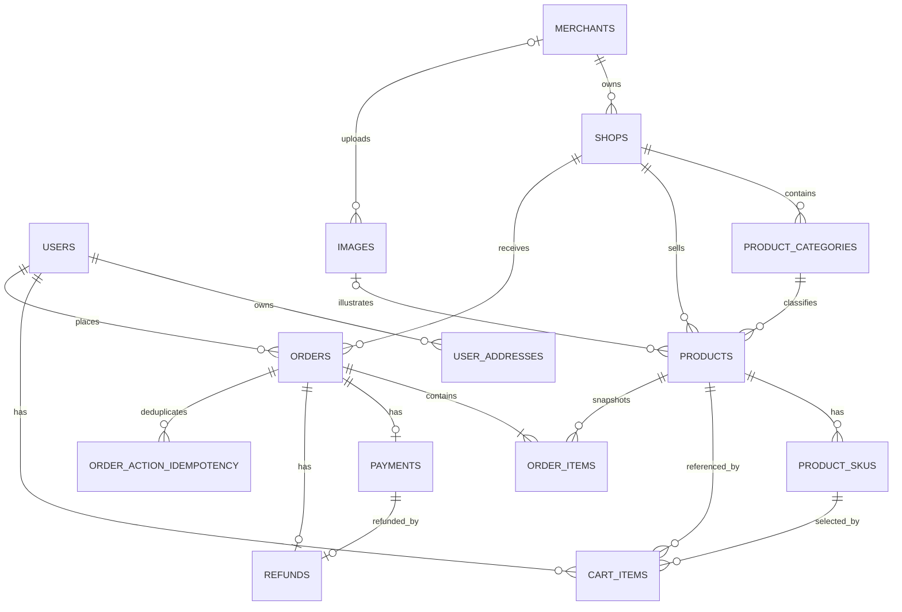

# 轻量级外卖服务平台数据库设计说明书

| 项目             | 内容                                 |
| ---------------- | ------------------------------------ |
| 文档版本         | V1.2                                 |
| 对应代码基线     | `develop@1b61327`                  |
| 数据库           | MySQL 8.4                            |
| 字符集与排序规则 | `utf8mb4` / `utf8mb4_unicode_ci` |
| 持久化技术       | MyBatis + Flyway                     |
| 编制日期         | 2026-09-14                           |
| 数据库负责人     | B（后端业务与数据库）                |

## 1. 文档目的与事实依据

本文档描述当前项目**实际能够由代码创建并被业务代码使用**的最终数据库结构，用于项目交付、部署、答辩、联调和后续迭代。它不是最初方案，也不是仅描述 V1 的历史文档。

结构事实按以下优先级确定：

1. `services/*-service/src/main/resources/db/migration/`：各服务数据库结构的唯一执行来源；
2. `services/*-service/src/main/resources/mapper/**/*.xml`：实际 SQL 读写、查询条件和索引使用场景；
3. `services/*-service/src/main/java/**/entity`、`**/dao`、`**/service/impl`：字段映射、事务、状态流转和数据规则；
4. `docs/api/backend-api-design.md` 与 `docs/software-requirements-specification.md`：业务契约和需求语义。

Flyway 会按版本顺序执行 V1–V10。不得修改已经提交并运行过的迁移文件；任何后续结构调整必须新增 V11、V12 等更高版本迁移。

## 2. 设计范围

当前共有 14 张业务表：

| 领域   | 表                           | 用途                                  |
| ------ | ---------------------------- | ------------------------------------- |
| 用户   | `users`                    | 普通用户账号和资料                    |
| 用户   | `user_addresses`           | 用户收货地址和默认地址                |
| 商家   | `merchants`                | 独立商家账号和资料                    |
| 店铺   | `shops`                    | 店铺、营业状态和店铺地址              |
| 商品   | `product_categories`       | 店铺内商品分类                        |
| 商品   | `products`                 | 商品主体和展示信息                    |
| 商品   | `product_skus`             | SKU、实际价格、库存、上下架状态和版本 |
| 商品   | `images`                   | 商家上传的图片元数据与二进制内容      |
| 购物车 | `cart_items`               | 用户购物车中的 SKU 和数量             |
| 订单   | `orders`                   | 订单主表、状态、地址快照和幂等信息    |
| 订单   | `order_items`              | 下单时的商品/SKU/价格/图片快照        |
| 支付   | `payments`                 | 订单支付结果                          |
| 退款   | `refunds`                  | 已支付订单的退款结果                  |
| 幂等   | `order_action_idempotency` | 支付、取消、备餐、配送、收货动作去重  |

`flyway_schema_history` 由 Flyway 自动维护，不属于业务表，但部署和验收时必须保留，用于记录迁移版本、校验和与执行结果。

## 3. 总体关系模型



关键基数说明：

- 普通用户和商家使用独立账号体系，`users` 与 `merchants` 不存在外键关系；
- 一个商家可以拥有多个店铺；一个店铺只能属于一个商家；
- 一个商品属于一个店铺和一个分类，可以有多个 SKU；
- 购物车按“用户 + SKU”唯一，同一 SKU 重复加入时合并数量；
- 一个订单属于一个用户和一个店铺，至少包含一条订单明细；
- 每个订单最多一条支付记录、最多一条退款记录；
- `order_action_idempotency.actor_id` 根据 `actor_type` 指向用户或商家，因此有意不设置多态外键。

## 4. 命名和通用约定

- 表名、字段名、索引名均使用小写蛇形命名；
- 业务主键统一使用 `BIGINT UNSIGNED AUTO_INCREMENT`；
- 金额使用 `DECIMAL(10,2)`，禁止使用浮点数；
- 时间统一使用毫秒精度 `DATETIME(3)`；
- `created_at` 由数据库写入，带 `updated_at` 的表由数据库自动更新时间；
- 密码只保存 BCrypt 等不可逆哈希，字段为 `password_hash`，不保存明文；
- 外键删除和更新均为 `RESTRICT`，防止误删历史业务数据；
- 店铺、分类、地址使用 `deleted_at` 实现逻辑删除；
- 订单明细、店铺名、地址和图片 URL 在下单时保存快照，避免基础资料改变后污染历史订单。

## 5. 数据表详细设计

### 5.1 `users`：普通用户

| 字段              | 类型            | 空值/默认值          | 键或约束               | 说明                     |
| ----------------- | --------------- | -------------------- | ---------------------- | ------------------------ |
| `id`            | BIGINT UNSIGNED | NOT NULL，自增       | PK                     | 用户主键                 |
| `account`       | VARCHAR(50)     | NOT NULL             | UK`uk_users_account` | 登录账号                 |
| `password_hash` | VARCHAR(100)    | NOT NULL             |                        | 密码哈希                 |
| `nickname`      | VARCHAR(50)     | NOT NULL             |                        | 用户昵称                 |
| `phone`         | VARCHAR(20)     | NULL                 |                        | 联系电话                 |
| `status`        | VARCHAR(20)     | NOT NULL，`ACTIVE` | CHECK                  | `ACTIVE`、`DISABLED` |
| `created_at`    | DATETIME(3)     | 当前时间             |                        | 创建时间                 |
| `updated_at`    | DATETIME(3)     | 当前时间并自动更新   |                        | 修改时间                 |

用途：普通用户注册、登录、资料查询和账号状态校验。账号禁用后，Service 层拒绝登录和需要活动账号的业务操作。

### 5.2 `merchants`：商家账号

| 字段              | 类型            | 空值/默认值          | 键或约束                   | 说明                      |
| ----------------- | --------------- | -------------------- | -------------------------- | ------------------------- |
| `id`            | BIGINT UNSIGNED | NOT NULL，自增       | PK                         | 商家主键                  |
| `account`       | VARCHAR(50)     | NOT NULL             | UK`uk_merchants_account` | 独立商家登录账号          |
| `password_hash` | VARCHAR(100)    | NOT NULL             |                            | 密码哈希                  |
| `name`          | VARCHAR(100)    | NOT NULL             |                            | 商家名称                  |
| `phone`         | VARCHAR(20)     | NOT NULL             |                            | 商家电话                  |
| `status`        | VARCHAR(20)     | NOT NULL，`ACTIVE` | CHECK                      | `ACTIVE`、`SUSPENDED` |
| `created_at`    | DATETIME(3)     | 当前时间             |                            | 创建时间                  |
| `updated_at`    | DATETIME(3)     | 当前时间并自动更新   |                            | 修改时间                  |

V2 已删除 V1 中的 `user_id`，因此商家不是普通用户附属记录，而是完全独立的认证主体。

### 5.3 `shops`：店铺

| 字段               | 类型            | 空值/默认值          | 键或约束                 | 说明                                         |
| ------------------ | --------------- | -------------------- | ------------------------ | -------------------------------------------- |
| `id`             | BIGINT UNSIGNED | NOT NULL，自增       | PK                       | 店铺主键                                     |
| `merchant_id`    | BIGINT UNSIGNED | NOT NULL             | FK →`merchants.id`    | 所属商家                                     |
| `name`           | VARCHAR(100)    | NOT NULL             | UK`(merchant_id,name)` | 店铺名称                                     |
| `description`    | VARCHAR(500)    | NULL                 |                          | 店铺简介                                     |
| `status`         | VARCHAR(30)     | NOT NULL，`CLOSED` | CHECK                    | `OPEN`、`CLOSED`、`TEMPORARILY_CLOSED` |
| `created_at`     | DATETIME(3)     | 当前时间             |                          | 创建时间                                     |
| `updated_at`     | DATETIME(3)     | 当前时间并自动更新   |                          | 修改时间                                     |
| `deleted_at`     | DATETIME(3)     | NULL                 |                          | 逻辑删除时间                                 |
| `address_region` | VARCHAR(100)    | NULL                 |                          | 店铺所在地区                                 |
| `address_detail` | VARCHAR(200)    | NULL                 |                          | 店铺详细地址                                 |
| `address_phone`  | VARCHAR(20)     | NULL                 |                          | 店铺联系号码                                 |

索引：

- `uk_shops_merchant_name(merchant_id,name)`：同一商家店铺名称唯一；
- `idx_shops_public_list(deleted_at,status,created_at)`：支持公开营业店铺分页查询。

### 5.4 `product_categories`：商品分类

| 字段           | 类型            | 空值/默认值        | 键或约束             | 说明         |
| -------------- | --------------- | ------------------ | -------------------- | ------------ |
| `id`         | BIGINT UNSIGNED | NOT NULL，自增     | PK                   | 分类主键     |
| `shop_id`    | BIGINT UNSIGNED | NOT NULL           | FK →`shops.id`    | 所属店铺     |
| `name`       | VARCHAR(100)    | NOT NULL           | UK`(shop_id,name)` | 分类名称     |
| `sort_order` | INT UNSIGNED    | NOT NULL，0        |                      | 越小越靠前   |
| `created_at` | DATETIME(3)     | 当前时间           |                      | 创建时间     |
| `updated_at` | DATETIME(3)     | 当前时间并自动更新 |                      | 修改时间     |
| `deleted_at` | DATETIME(3)     | NULL               |                      | 逻辑删除时间 |

索引 `idx_categories_shop_order(shop_id,deleted_at,sort_order,id)` 支持店铺内有效分类排序。分类存在商品引用时不能物理删除。

### 5.5 `products`：商品主体

| 字段            | 类型            | 空值/默认值            | 键或约束                       | 说明                      |
| --------------- | --------------- | ---------------------- | ------------------------------ | ------------------------- |
| `id`          | BIGINT UNSIGNED | NOT NULL，自增         | PK                             | 商品主键                  |
| `shop_id`     | BIGINT UNSIGNED | NOT NULL               | FK →`shops.id`              | 所属店铺                  |
| `category_id` | BIGINT UNSIGNED | NOT NULL               | FK →`product_categories.id` | 所属分类                  |
| `name`        | VARCHAR(100)    | NOT NULL               |                                | 商品名称                  |
| `description` | VARCHAR(1000)   | NULL                   |                                | 商品说明                  |
| `price`       | DECIMAL(10,2)   | NOT NULL               | CHECK`> 0`                   | V1 兼容价格               |
| `stock`       | INT UNSIGNED    | NOT NULL，0            | CHECK`>= 0`                  | V1 兼容库存               |
| `status`      | VARCHAR(20)     | NOT NULL，`OFF_SALE` | CHECK                          | `ON_SALE`、`OFF_SALE` |
| `version`     | BIGINT UNSIGNED | NOT NULL，1            |                                | 商品更新乐观锁版本        |
| `image_id`    | BIGINT UNSIGNED | NULL                   | FK →`images.id`             | 商品主图                  |
| `created_at`  | DATETIME(3)     | 当前时间               |                                | 创建时间                  |
| `updated_at`  | DATETIME(3)     | 当前时间并自动更新     |                                | 修改时间                  |

索引：`idx_products_shop_status(shop_id,status)`、`idx_products_category(category_id)`。

V10 后，实际成交价格、可售库存、SKU 上下架状态和库存并发版本以 `product_skus` 为业务真值。`products.price/stock/status/version` 仍被保留并用于商品主体兼容、列表过滤和商品级更新，不能擅自删除。

### 5.6 `product_skus`：商品规格和库存真值

| 字段           | 类型            | 空值/默认值            | 键或约束                | 说明                      |
| -------------- | --------------- | ---------------------- | ----------------------- | ------------------------- |
| `id`         | BIGINT UNSIGNED | NOT NULL，自增         | PK                      | SKU 主键                  |
| `product_id` | BIGINT UNSIGNED | NOT NULL               | FK →`products.id`    | 所属商品                  |
| `name`       | VARCHAR(100)    | NOT NULL               | UK`(product_id,name)` | 规格名称                  |
| `price`      | DECIMAL(10,2)   | NOT NULL               | CHECK`> 0`            | 实际成交单价              |
| `stock`      | INT UNSIGNED    | NOT NULL，0            | CHECK`>= 0`           | 实际可售库存              |
| `status`     | VARCHAR(20)     | NOT NULL，`OFF_SALE` | CHECK                   | `ON_SALE`、`OFF_SALE` |
| `version`    | BIGINT UNSIGNED | NOT NULL，1            |                         | 库存乐观锁版本            |
| `created_at` | DATETIME(3)     | 当前时间               |                         | 创建时间                  |
| `updated_at` | DATETIME(3)     | 当前时间并自动更新     |                         | 修改时间                  |

约束与索引：`uk_product_skus_name(product_id,name)`、`idx_product_skus_product(product_id)`。

库存预占采用条件更新：SKU 必须上架、库存足够且版本一致，成功后扣减库存并将 `version + 1`。取消订单时恢复库存并增加版本，防止并发超卖和丢失更新。

### 5.7 `images`：商品图片

| 字段             | 类型            | 空值/默认值    | 键或约束              | 说明                       |
| ---------------- | --------------- | -------------- | --------------------- | -------------------------- |
| `id`           | BIGINT UNSIGNED | NOT NULL，自增 | PK                    | 图片主键                   |
| `merchant_id`  | BIGINT UNSIGNED | NULL           | FK →`merchants.id` | 上传商家；历史数据允许空   |
| `url`          | VARCHAR(500)    | NOT NULL       |                       | API 访问地址               |
| `content_type` | VARCHAR(100)    | NOT NULL       |                       | MIME 类型                  |
| `size`         | BIGINT UNSIGNED | NOT NULL       |                       | 字节数                     |
| `content`      | LONGBLOB        | NULL           |                       | 图片二进制；历史记录允许空 |
| `created_at`   | DATETIME(3)     | 当前时间       |                       | 上传时间                   |

索引 `idx_images_merchant_created(merchant_id,created_at)` 支持归属校验和商家图片查询。新上传图片由 Service 写入 `merchant_id`、元数据和二进制；应用层限制单文件不超过 5 MB，并限制允许的图片 MIME 类型。

### 5.8 `user_addresses`：用户收货地址

| 字段                       | 类型            | 空值/默认值        | 键或约束          | 说明                                       |
| -------------------------- | --------------- | ------------------ | ----------------- | ------------------------------------------ |
| `id`                     | BIGINT UNSIGNED | NOT NULL，自增     | PK                | 地址主键                                   |
| `user_id`                | BIGINT UNSIGNED | NOT NULL           | FK →`users.id` | 所属用户                                   |
| `recipient`              | VARCHAR(50)     | NOT NULL           |                   | 收货人                                     |
| `phone`                  | VARCHAR(20)     | NOT NULL           |                   | 收货电话                                   |
| `region`                 | VARCHAR(100)    | NOT NULL           |                   | 地区                                       |
| `detail`                 | VARCHAR(200)    | NOT NULL           |                   | 详细地址                                   |
| `is_default`             | BOOLEAN         | NOT NULL，FALSE    |                   | 是否默认地址                               |
| `deleted_at`             | DATETIME(3)     | NULL               |                   | 逻辑删除时间                               |
| `created_at`             | DATETIME(3)     | 当前时间           |                   | 创建时间                                   |
| `updated_at`             | DATETIME(3)     | 当前时间并自动更新 |                   | 修改时间                                   |
| `active_default_user_id` | BIGINT UNSIGNED | 生成列             | UK                | 有效默认地址时等于`user_id`，否则为 NULL |

`active_default_user_id` 是 STORED 生成列，表达式为：仅当 `deleted_at IS NULL AND is_default = TRUE` 时返回 `user_id`。唯一索引 `uk_user_addresses_active_default` 从数据库层保证一个用户最多只有一个未删除的默认地址。索引 `idx_addresses_user(user_id,deleted_at)` 支持有效地址列表。

### 5.9 `cart_items`：购物车项

| 字段            | 类型            | 空值/默认值        | 键或约束                 | 说明                 |
| --------------- | --------------- | ------------------ | ------------------------ | -------------------- |
| `id`          | BIGINT UNSIGNED | NOT NULL，自增     | PK                       | 购物车项主键         |
| `user_id`     | BIGINT UNSIGNED | NOT NULL           | FK →`users.id`        | 所属用户             |
| `product_id`  | BIGINT UNSIGNED | NOT NULL           | FK →`products.id`     | 商品主体             |
| `sku_id`      | BIGINT UNSIGNED | NOT NULL           | FK →`product_skus.id` | 选中 SKU             |
| `sku_version` | BIGINT UNSIGNED | NOT NULL           |                          | 加入/确认时 SKU 版本 |
| `quantity`    | INT UNSIGNED    | NOT NULL           | CHECK`> 0`             | 购买数量             |
| `created_at`  | DATETIME(3)     | 当前时间           |                          | 加入时间             |
| `updated_at`  | DATETIME(3)     | 当前时间并自动更新 |                          | 修改时间             |

约束与索引：

- `uk_cart_items_user_sku(user_id,sku_id)`：同一用户同一 SKU 只存在一行；
- `idx_cart_items_user(user_id)`：购物车列表；
- `idx_cart_sku(user_id,sku_id)`：用户和 SKU 查询；
- Mapper 联结 `products`、`product_skus`、`shops`、`images` 返回最新展示数据。

购物车不冻结价格和库存；提交订单时必须重新检查 SKU 状态、库存和版本。

### 5.10 `orders`：订单主表

| 字段                        | 类型            | 空值/默认值                   | 键或约束            | 说明                  |
| --------------------------- | --------------- | ----------------------------- | ------------------- | --------------------- |
| `id`                      | BIGINT UNSIGNED | NOT NULL，自增                | PK                  | 订单主键              |
| `order_no`                | VARCHAR(40)     | NOT NULL                      | UK                  | 对外订单号            |
| `user_id`                 | BIGINT UNSIGNED | NOT NULL                      | FK →`users.id`   | 下单用户              |
| `idempotency_key`         | VARCHAR(100)    | NOT NULL                      | UK`(user_id,key)` | 创建订单幂等键        |
| `request_fingerprint`     | CHAR(64)        | NOT NULL                      |                     | 创建请求 SHA-256 指纹 |
| `shop_id`                 | BIGINT UNSIGNED | NOT NULL                      | FK →`shops.id`   | 接单店铺              |
| `shop_name`               | VARCHAR(100)    | NOT NULL                      |                     | 下单时店铺名快照      |
| `total_amount`            | DECIMAL(10,2)   | NOT NULL                      | CHECK`> 0`        | 订单总额              |
| `status`                  | VARCHAR(30)     | NOT NULL，`PENDING_PAYMENT` | CHECK               | 订单状态              |
| `payment_status`          | VARCHAR(20)     | NOT NULL，`UNPAID`          |                     | 支付状态              |
| `refund_status`           | VARCHAR(20)     | NOT NULL，`NOT_REFUNDED`    |                     | 退款状态              |
| `remark`                  | VARCHAR(500)    | NULL                          |                     | 用户备注              |
| `cancel_reason`           | VARCHAR(200)    | NULL                          |                     | 取消原因              |
| `user_address_snapshot`   | JSON            | NULL                          |                     | 收货地址快照          |
| `shop_address_snapshot`   | JSON            | NULL                          |                     | 店铺地址快照          |
| `cancel_idempotency_key`  | VARCHAR(100)    | NULL                          | UK`(user_id,key)` | V7 兼容取消幂等键     |
| `pay_idempotency_key`     | VARCHAR(100)    | NULL                          |                     | V8 兼容支付幂等键     |
| `prepare_idempotency_key` | VARCHAR(100)    | NULL                          |                     | V8 兼容备餐幂等键     |
| `deliver_idempotency_key` | VARCHAR(100)    | NULL                          |                     | V8 兼容配送幂等键     |
| `receipt_idempotency_key` | VARCHAR(100)    | NULL                          |                     | V8 兼容收货幂等键     |
| `created_at`              | DATETIME(3)     | 当前时间                      |                     | 创建时间              |
| `updated_at`              | DATETIME(3)     | 当前时间并自动更新            |                     | 修改时间              |
| `cancelled_at`            | DATETIME(3)     | NULL                          |                     | 取消时间              |
| `completed_at`            | DATETIME(3)     | NULL                          |                     | 完成时间              |

订单状态只允许：`PENDING_PAYMENT`、`PAID`、`PREPARING`、`DELIVERING`、`COMPLETED`、`CANCELLED`。

索引：

- `uk_orders_order_no(order_no)`；
- `uk_orders_user_idempotency(user_id,idempotency_key)`；
- `uk_orders_cancel_idempotency_key(user_id,cancel_idempotency_key)`；
- `idx_orders_user_created(user_id,created_at)`；
- `idx_orders_shop_status_created(shop_id,status,created_at)`。

地址 JSON 的实际键：用户地址为 `recipient`、`phone`、`region`、`detail`；店铺地址为 `region`、`detail`、`phone`。

### 5.11 `order_items`：订单明细快照

| 字段             | 类型            | 空值/默认值    | 键或约束             | 说明            |
| ---------------- | --------------- | -------------- | -------------------- | --------------- |
| `id`           | BIGINT UNSIGNED | NOT NULL，自增 | PK                   | 明细主键        |
| `order_id`     | BIGINT UNSIGNED | NOT NULL       | FK →`orders.id`   | 所属订单        |
| `product_id`   | BIGINT UNSIGNED | NOT NULL       | FK →`products.id` | 原商品          |
| `product_name` | VARCHAR(100)    | NOT NULL       |                      | 下单时商品名    |
| `unit_price`   | DECIMAL(10,2)   | NOT NULL       | CHECK`> 0`         | 下单时 SKU 单价 |
| `quantity`     | INT UNSIGNED    | NOT NULL       | CHECK`> 0`         | 数量            |
| `sku_id`       | BIGINT UNSIGNED | NULL           | 无外键               | 下单时 SKU 标识 |
| `sku_name`     | VARCHAR(100)    | NULL           |                      | 下单时规格名    |
| `image_url`    | VARCHAR(500)    | NULL           |                      | 下单时图片 URL  |

索引 `idx_order_items_order(order_id)` 支持按订单读取明细。名称、价格、规格名和图片 URL 均为历史快照；当前结构没有为 `sku_id` 建立外键，这是实际结构而非遗漏描述。

### 5.12 `payments`：支付记录

| 字段                | 类型            | 空值/默认值    | 键或约束               | 说明                 |
| ------------------- | --------------- | -------------- | ---------------------- | -------------------- |
| `id`              | BIGINT UNSIGNED | NOT NULL，自增 | PK                     | 支付主键             |
| `order_id`        | BIGINT UNSIGNED | NOT NULL       | UK、FK →`orders.id` | 每单最多一次支付     |
| `payment_number`  | VARCHAR(64)     | NOT NULL       |                        | 支付流水号           |
| `amount`          | DECIMAL(10,2)   | NOT NULL       |                        | 支付金额             |
| `status`          | VARCHAR(20)     | NOT NULL       |                        | 当前实现写入`PAID` |
| `idempotency_key` | VARCHAR(100)    | NOT NULL       | 非唯一                 | 原动作幂等键         |
| `paid_at`         | DATETIME(3)     | NULL           |                        | 支付完成时间         |
| `created_at`      | DATETIME(3)     | 当前时间       |                        | 创建时间             |

V10 删除了 `idempotency_key` 的全局唯一索引，动作幂等由 `order_action_idempotency` 按行为主体和动作作用域统一保证。

### 5.13 `refunds`：退款记录

| 字段                | 类型            | 空值/默认值    | 键或约束                 | 说明                     |
| ------------------- | --------------- | -------------- | ------------------------ | ------------------------ |
| `id`              | BIGINT UNSIGNED | NOT NULL，自增 | PK                       | 退款主键                 |
| `order_id`        | BIGINT UNSIGNED | NOT NULL       | UK、FK →`orders.id`   | 每单最多一次退款         |
| `payment_id`      | BIGINT UNSIGNED | NOT NULL       | UK、FK →`payments.id` | 对应原支付               |
| `refund_number`   | VARCHAR(64)     | NOT NULL       |                          | 退款流水号               |
| `amount`          | DECIMAL(10,2)   | NOT NULL       |                          | 退款金额                 |
| `status`          | VARCHAR(20)     | NOT NULL       |                          | 当前实现写入`REFUNDED` |
| `idempotency_key` | VARCHAR(100)    | NULL           | 非唯一                   | 原动作幂等键             |
| `completed_at`    | DATETIME(3)     | NULL           |                          | 完成时间                 |
| `created_at`      | DATETIME(3)     | 当前时间       |                          | 创建时间                 |

V10 将 `payment_id` 回填并改为 NOT NULL，同时增加 `uk_refunds_payment(payment_id)`；支付和退款形成一对零或一关系。

### 5.14 `order_action_idempotency`：订单动作幂等

| 字段                    | 类型            | 空值/默认值    | 键或约束           | 说明                     |
| ----------------------- | --------------- | -------------- | ------------------ | ------------------------ |
| `id`                  | BIGINT UNSIGNED | NOT NULL，自增 | PK                 | 记录主键                 |
| `actor_type`          | VARCHAR(20)     | NOT NULL       | 复合 UK            | `USER` 或 `MERCHANT` |
| `actor_id`            | BIGINT UNSIGNED | NOT NULL       | 复合 UK，无外键    | 用户或商家 ID            |
| `action_name`         | VARCHAR(40)     | NOT NULL       | 复合 UK            | 动作名称                 |
| `idempotency_key`     | VARCHAR(100)    | NOT NULL       | 复合 UK            | 客户端幂等键             |
| `request_fingerprint` | CHAR(64)        | NOT NULL       |                    | 请求内容 SHA-256 指纹    |
| `order_id`            | BIGINT UNSIGNED | NOT NULL       | FK →`orders.id` | 对应订单                 |
| `created_at`          | DATETIME(3)     | 当前时间       |                    | 首次执行时间             |

唯一约束 `uk_order_action_actor_key(actor_type,actor_id,action_name,idempotency_key)` 保证相同主体的相同动作重试只生效一次。当前动作值为：

- 用户：`PAY_ORDER`、`CANCEL_ORDER`、`CONFIRM_RECEIPT`；
- 商家：`PREPARE_ORDER`、`DELIVER_ORDER`。

索引 `idx_order_action_order(order_id)` 支持按订单追踪幂等记录。

## 6. 状态与业务流转

### 6.1 订单状态机

```text
PENDING_PAYMENT --支付--> PAID --接单/备餐--> PREPARING
PREPARING --开始配送--> DELIVERING --确认收货--> COMPLETED

PENDING_PAYMENT --取消--> CANCELLED
PAID            --取消并退款--> CANCELLED
PREPARING       --取消并退款--> CANCELLED
```

订单状态迁移使用带原状态条件的 `UPDATE`，避免两个并发请求重复推进状态。取消、支付、备餐、配送和确认收货还会在同一事务中登记动作幂等记录。

### 6.2 支付和退款状态

- 新订单：`payment_status=UNPAID`、`refund_status=NOT_REFUNDED`；
- 支付成功：订单进入 `PAID`，`payment_status=PAID`，写入 `payments`；
- 已支付订单取消：订单进入 `CANCELLED`，`refund_status=REFUNDED`，写入 `refunds` 并关联原支付；
- 未支付订单取消：不创建支付和退款记录。

支付/退款状态字段目前没有数据库 CHECK，合法值由 Service 层和测试保证。

## 7. 一致性、并发和事务设计

### 7.1 创建订单

创建订单的一个事务至少完成：

1. 校验用户、地址、店铺、购物车项及其归属；
2. 锁定所选购物车数据；
3. 校验商品/SKU 上架状态、SKU 版本和库存；
4. 使用乐观锁逐项扣减 SKU 库存；
5. 写入 `orders` 和 `order_items` 快照；
6. 删除已结算的购物车项；
7. 通过 `(user_id,idempotency_key)` 防止重复创建。

任一步失败均回滚，避免出现扣库存但没有订单、只有订单主表没有明细等部分成功状态。

### 7.2 默认地址并发

Service 在修改用户地址前锁定用户记录，并先清除旧默认地址；数据库的生成列唯一约束作为最终防线，确保一个用户最多一个有效默认地址。

### 7.3 图片归属

新图片保存上传商家 ID。商品设置图片时，Service 必须同时校验商品所属店铺与图片所属商家，防止商家引用其他商家的图片。

### 7.4 删除策略

- `shops`、`product_categories`、`user_addresses`：逻辑删除；
- `cart_items`：允许物理删除；
- 用户、商家、商品、订单、支付、退款和图片没有业务物理删除入口；
- 所有外键均限制级联删除，历史订单和关联数据不会因删除基础记录而丢失。

## 8. 索引与主要查询对应关系

| 查询场景               | 使用的主要索引/约束                            |
| ---------------------- | ---------------------------------------------- |
| 用户/商家登录          | `uk_users_account`、`uk_merchants_account` |
| 公开营业店铺列表       | `idx_shops_public_list`                      |
| 商家名下店铺           | `merchant_id` 作为唯一索引前缀及外键索引     |
| 店铺分类排序           | `idx_categories_shop_order`                  |
| 店铺在售商品           | `idx_products_shop_status`                   |
| 商品 SKU 列表          | `idx_product_skus_product`                   |
| 用户有效地址           | `idx_addresses_user`                         |
| 用户购物车             | `idx_cart_items_user`                        |
| 用户订单按时间分页     | `idx_orders_user_created`                    |
| 商家按店铺和状态查订单 | `idx_orders_shop_status_created`             |
| 订单明细               | `idx_order_items_order`                      |
| 图片归属/时间          | `idx_images_merchant_created`                |
| 订单动作去重           | `uk_order_action_actor_key`                  |

## 9. Flyway 版本演进

| 版本 | 主要作用                                                                             |
| ---- | ------------------------------------------------------------------------------------ |
| V1   | 创建最初 8 张核心表                                                                  |
| V2   | 商家独立账号、多店铺、逻辑删除、订单状态与创建幂等                                   |
| V3   | 增加 SKU、地址、图片、支付、退款和订单快照                                           |
| V4   | 增加退款幂等键                                                                       |
| V5   | 将购物车唯一规则调整为用户 + SKU，并补 SKU/图片外键                                  |
| V6   | 图片二进制内容入库                                                                   |
| V7   | 增加订单取消幂等字段                                                                 |
| V8   | 增加支付、备餐、配送、收货幂等兼容字段                                               |
| V9   | 退款关联原支付                                                                       |
| V10  | SKU 真值回填、购物车字段收紧、默认地址唯一、图片归属、统一动作幂等和支付退款约束收口 |

应用启动时：

- `spring.flyway.enabled=true`；
- 迁移位置为 `classpath:db/migration`；
- `spring.flyway.validate-on-migrate=true`，历史迁移校验和不一致会阻止启动；
- 各服务使用独立的 `delivery_identity`、`delivery_catalog`、`delivery_cart`、`delivery_order` 和 `delivery_media` 数据库。

## 10. 安全和隐私

- 用户、商家密码只存哈希，API 响应和日志不得返回 `password_hash`；
- 数据库账号和密码来自各服务的 `*_DB_USERNAME`、`*_DB_PASSWORD` 环境变量，不得提交真实 `.env`；
- JWT 密钥不存数据库，由 `JWT_SECRET` 注入；
- 地址和电话属于个人信息，接口与 DAO 均按当前登录主体 ID 限制访问；
- 图片读取可以公开，但上传、绑定和归属校验仅允许活动商家；
- 订单查询分别使用 `user_id` 或店铺所属 `merchant_id` 做数据隔离。

## 11. 当前真实边界与后续变更规则

以下内容是当前代码和数据库的真实兼容边界，交付时不得隐瞒，也不应在没有新需求时擅自重构：

1. `products` 仍保留 V1 的价格、库存、状态、版本；V1.2 实际结算和库存并发以 `product_skus` 为准；
2. `orders` 仍保留 V7/V8 的五个动作幂等字段，V10 的统一动作幂等表是当前主要机制；
3. `images.merchant_id` 和 `images.content` 为兼容历史迁移允许 NULL，新上传记录会写入；
4. `order_items.sku_id` 当前没有外键，订单行依赖自身快照展示历史信息；
5. 支付和退款的状态、金额正值没有数据库 CHECK，由业务层和测试约束；
6. 店铺和分类名称唯一约束包含已逻辑删除数据，因此删除后不能在同一作用域复用相同名称；
7. 图片二进制直接保存在 MySQL，适合本课程项目规模；大规模生产系统应改用对象存储，但不属于当前必要范围；
8. 所有迁移必须向前追加，禁止修改 V1–V10 或手工修改交付数据库结构。

## 12. 部署与验收检查

首次连接空数据库并启动后端后，执行：

```sql
SELECT installed_rank, version, description, success
FROM flyway_schema_history
ORDER BY installed_rank;
```

预期 V1–V10 均存在且 `success=1`。再检查业务表：

```sql
SELECT table_name
FROM information_schema.tables
WHERE table_schema = DATABASE()
  AND table_type = 'BASE TABLE'
ORDER BY table_name;
```

预期包含本文列出的 14 张业务表及 Flyway 自身的 `flyway_schema_history`。

重点约束可执行：

```sql
SHOW CREATE TABLE user_addresses;
SHOW CREATE TABLE cart_items;
SHOW CREATE TABLE orders;
SHOW CREATE TABLE order_action_idempotency;
SHOW CREATE TABLE refunds;
```

项目交付应以“空库可由 Flyway 完整迁移到 V10、应用能够启动、后端数据库集成测试通过”为数据库验收标准，而不是以某一台开发电脑中手工创建的表为准。
