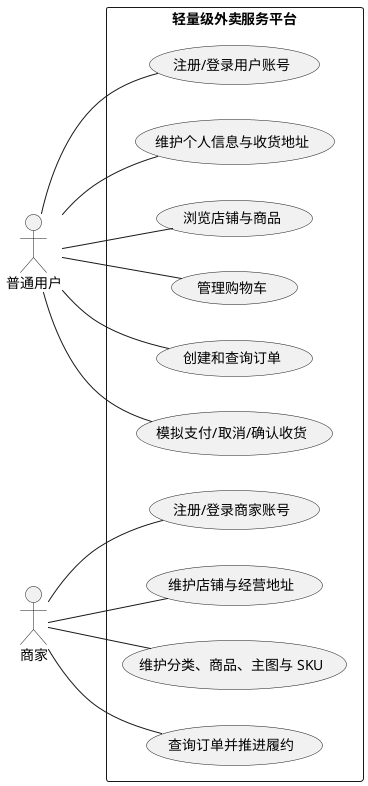
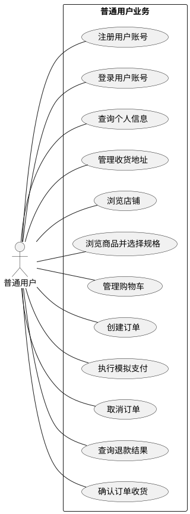
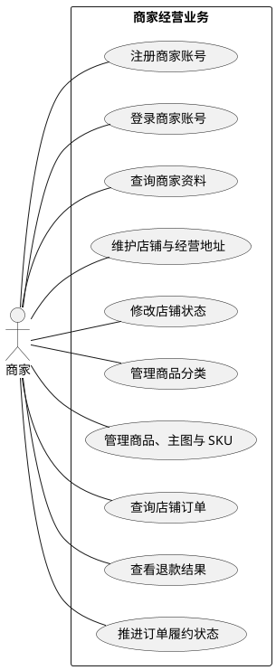
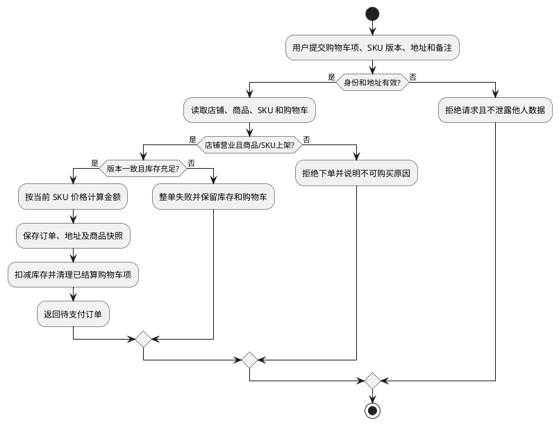
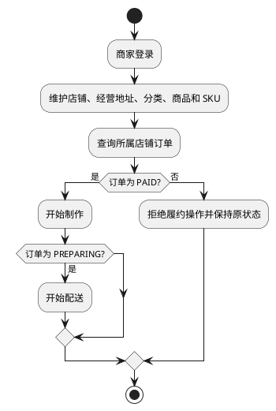
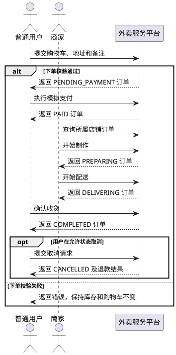
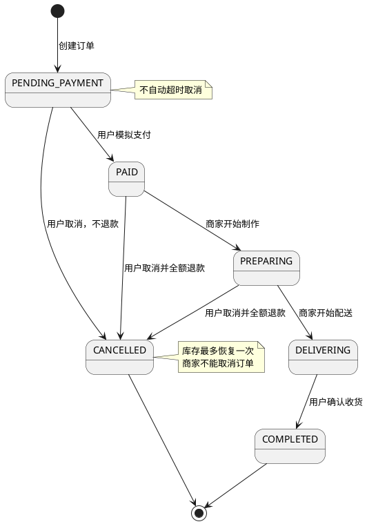
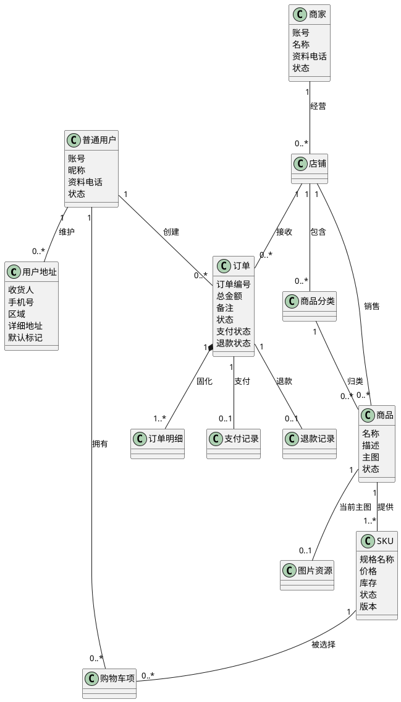

# 软件需求规格说明书

## 1. 文档说明

### 1.1 编写目的

本文档用于明确轻量级外卖服务平台的业务目标、系统边界、参与者、功能需求、业务规则、非功能需求、数据约束、接口约束和验收标准，为以下工作提供统一依据：

1. 项目组统一业务理解并开展系统设计；
2. 开发和测试人员确认系统行为与验收条件；
3. 前后端依据一致的需求范围进行开发和联调；
4. 评审人员依据明确、可验证的标准进行验收。

本文档以“业务目标 → 用例 → 业务规则 → 接口/数据 → 测试 → 验收”为主要追踪链路，需求变更必须同步更新受影响的内容。

### 1.2 项目背景

本项目是 26271 学期软件工程综合实践项目，项目周期为 2026-08-31 至 2026-09-20，共 3 周。系统参考饿了么等外卖平台的核心业务流程，为普通用户提供店铺和商品浏览、购物车管理、订单创建及订单查询能力，为商家提供店铺、商品分类、商品和库存管理能力。

项目以完整、可验证的外卖核心流程为目标，重点明确系统边界、业务数据、正常与异常流程以及用户和商家的权限关系。

### 1.3 项目目标

#### 1.3.1 业务目标

1. 系统应允许普通用户注册、登录并维护个人信息；
2. 系统应允许普通用户浏览店铺、查看商品并完成购物车操作；
3. 系统应允许普通用户维护收货地址，并根据购物车创建带地址和备注的订单；
4. 系统应支持普通用户完成模拟支付、取消订单、查询退款状态和确认收货；
5. 系统应允许商家注册并管理自己的店铺资料、店铺地址和营业状态；
6. 系统应允许商家维护商品分类、主图、规格、价格、上下架状态和库存；
7. 系统应允许商家查询店铺订单并推进制作和配送状态；
8. 系统应校验身份、权限、资源归属、状态迁移、价格、库存和幂等性。

### 1.4 术语与缩写

| 术语     | 说明                                             |
| -------- | ------------------------------------------------ |
| SKU      | 商品的可购买规格，独立维护价格、库存、状态和版本 |
| 地址快照 | 下单时复制到订单且不随地址簿修改而变化的收货信息 |
| 购物车项 | 用户购物车中某一 SKU 及其购买数量的记录          |
| 支付记录 | 一次模拟支付操作及其结果的业务记录               |
| 退款记录 | 已支付订单取消后形成的模拟退款业务记录           |
| 逻辑删除 | 保留数据记录但将其标记为不可用，不直接物理删除   |

### 1.5 版本记录

| 版本 | 日期 | 主要变更 |
| ---- | ---- | -------- |
| V1.0 | 9 月 4 日 | 建立基础业务需求、参与者和核心用例 |
| V1.2 | 9 月 9 日 | 补充图片、SKU、地址、订单备注、支付、退款和履约规则 |
| V1.3 | 9 月 14 日 | 集中业务流程并完善异常与验收表达 |

---

## 2. 系统愿景与范围

### 2.1 系统愿景

为普通用户提供店铺浏览、规格选择、地址管理、购物车、下单、模拟支付和确认收货服务；为商家提供店铺地址、商品、规格库存和订单履约管理能力，形成一个轻量级、可测试、可扩展的外卖服务平台。

### 2.2 系统边界

#### 2.2.1 系统内

- 用户注册、登录和个人信息管理；
- 商家注册和店铺状态管理；
- 店铺列表、详情和营业状态展示；
- 商品分类、商品信息、价格和库存管理；
- 单商品主图上传、替换和删除；
- 单规格维度的多 SKU、SKU 价格、库存和上下架管理；
- 用户收货地址簿和店铺经营地址管理；
- 购物车增删改查；
- 带收货地址快照和备注的订单创建、查询和状态展示；
- 模拟支付、商家开始制作和配送、用户确认收货；
- 待支付订单取消，以及已支付未配送订单取消后的同步模拟退款；
- 身份认证、权限控制、参数校验和错误处理。

#### 2.2.2 非本版本范围

​	本版本不包含真实支付、骑手及实时配送、部分退款与售后、地图服务、优惠评价、商家结算、管理员后台及第三方身份认证。以上能力不作为本版本开发和验收内容。

### 2.3 运行与外部约束

1. 系统以 Web 页面向普通用户和商家提供功能，并通过 HTTP 接口完成前后端交互。
2. 系统应持久保存账号、店铺、商品、SKU、地址、购物车、订单、支付和退款数据。
3. 系统应支持主流桌面浏览器访问，并支持部署到课程验收使用的局域网测试环境中。

---

## 3. 参与者分析

### 3.1 参与者定义

| 参与者 | 主要目标 | 触发的主要用例 |
| ------ | -------- | -------------- |
| 普通用户 | 浏览商品、管理地址和购物车、创建并处理订单 | 注册、登录、浏览店铺与商品、管理购物车、下单、支付、取消和确认收货 |
| 商家 | 经营店铺并处理订单 | 注册、登录、维护店铺、分类、商品、库存和推进履约 |

### 3.2 参与者边界

- 普通用户只能操作本人拥有的个人信息、购物车和订单；
- 商家只能操作自己注册或拥有的店铺、商品分类、商品和相关订单；
- 普通用户和商家是独立账号体系，不因账号文本或自然人相同而共享身份、令牌或数据权限；
- 同一自然人可以分别注册普通用户账号和商家账号，但一次登录会话只具有一种业务身份；
- 本版本没有管理员参与者，也不提供平台运营、账号封禁或数据库管理界面；
- 系统负责最终执行身份、资源归属和状态校验，界面是否展示操作入口不能替代系统校验。

### 3.3 系统用例图

图中的普通用户与商家是相互独立的登录身份。管理员、真实支付机构和骑手均不属于本版本参与者。

---

## 4. 用例与业务流程模型

### 4.1 用例清单

| 用例编号        | 用例名称           | 主要参与者     |
| --------------- | ------------------ | -------------- |
| UC-USER-001     | 注册用户账号       | 普通用户       |
| UC-USER-002     | 登录用户账号       | 普通用户       |
| UC-USER-003     | 查询个人信息       | 普通用户       |
| UC-USER-004     | 修改个人信息       | 普通用户       |
| UC-ADDRESS-001  | 管理用户收货地址   | 普通用户       |
| UC-MERCHANT-001 | 注册商家账号       | 商家           |
| UC-MERCHANT-002 | 登录商家账号       | 商家           |
| UC-MERCHANT-003 | 查询商家资料       | 商家           |
| UC-MERCHANT-004 | 修改商家资料       | 商家           |
| UC-MERCHANT-ORDER-001 | 查看店铺订单列表 | 商家         |
| UC-MERCHANT-ORDER-002 | 查看店铺订单详情 | 商家         |
| UC-SHOP-001     | 创建店铺           | 商家           |
| UC-SHOP-002     | 修改店铺状态       | 商家           |
| UC-SHOP-003     | 浏览店铺列表       | 普通用户       |
| UC-SHOP-004     | 查看店铺详情       | 普通用户       |
| UC-SHOP-005     | 维护店铺地址       | 商家           |
| UC-PRODUCT-001  | 管理商品分类       | 商家           |
| UC-PRODUCT-002  | 新增商品           | 商家           |
| UC-PRODUCT-003  | 修改商品           | 商家           |
| UC-PRODUCT-004  | 修改商品状态和库存 | 商家           |
| UC-PRODUCT-005  | 浏览店铺商品       | 普通用户       |
| UC-PRODUCT-006  | 管理商品主图       | 商家           |
| UC-PRODUCT-007  | 管理商品规格       | 商家           |
| UC-CART-001     | 加入购物车         | 普通用户       |
| UC-CART-002     | 查询购物车         | 普通用户       |
| UC-CART-003     | 修改购物车数量     | 普通用户       |
| UC-CART-004     | 删除购物车商品     | 普通用户       |
| UC-ORDER-001    | 创建订单           | 普通用户       |
| UC-ORDER-002    | 查询用户订单列表   | 普通用户       |
| UC-ORDER-003    | 查看订单详情       | 普通用户       |
| UC-ORDER-004    | 取消订单           | 普通用户       |
| UC-PAYMENT-001  | 执行模拟支付       | 普通用户       |
| UC-ORDER-005    | 确认订单收货       | 普通用户       |
| UC-REFUND-001   | 查询模拟退款结果   | 普通用户、所属订单商家 |
| UC-MERCHANT-ORDER-003 | 推进订单履约状态 | 商家         |

#### 4.1.1 普通用户用例图

#### 4.1.2 商家用例图

### 4.2 普通用户业务流程

普通用户业务流程由“认证与资料维护、店铺和商品浏览、购物车、订单交易”组成。用户先登录并维护有效收货地址，再浏览营业店铺及可售商品，选择 SKU 后加入购物车，最后提交订单并完成支付；支付后可取消允许取消的订单，或在商家配送后确认收货。

### 4.3 创建订单 UML 活动图

下单活动图描述普通用户从提交购物车到获得待支付订单的业务判断和异常分支；订单创建后的支付、履约、取消和收货状态约束见本章 4.6 节。

**下单关键异常规则**：

- 收货地址不存在、不属于当前用户或店铺不属于有效营业状态时，拒绝下单且不得泄露他人数据；
- 商品或 SKU 下架、SKU 版本过期或库存不足时，整单失败，库存和已提交购物车项保持不变；
- 任一 SKU 缺货时不创建部分订单，不扣减其他 SKU 库存；
- 订单、快照、库存扣减和购物车清理必须整体成功，持久化失败时全部回滚；
- 重复提交不得生成重复订单。

### 4.4 商家业务流程

商家先注册并登录独立的商家身份，维护商家资料、店铺经营地址和营业状态，再维护商品分类、商品主图及 SKU。商家查询所属店铺订单后，按照“开始制作、开始配送”的顺序推进订单；商家不能取消订单，也不能代替用户确认收货。

**商家履约关键异常规则**：

- 未登录、订单不存在或订单不属于当前商家时，拒绝操作；
- 系统仅允许所属店铺的 `PAID` 订单开始制作，且仅允许 `PREPARING` 订单开始配送；
- 试图跳过状态、重复推进或操作 `PENDING_PAYMENT`、`CANCELLED`、`DELIVERING`、`COMPLETED` 订单时，拒绝操作并保持原状态；
- 商家不得取消订单、发起退款或代替用户确认收货；系统应允许商家在所属订单详情中查看退款状态和退款结果；
- 并发推进冲突时不得覆盖其他请求已完成的状态迁移。

### 4.5 核心交易 UML 顺序图

顺序图描述普通用户、平台和商家在订单生命周期中的业务协作，不限定系统内部的模块或技术实现。

**交易流程关键异常规则**：

- 下单校验失败发生在订单创建阶段，不进入支付、商家履约或确认收货流程；
- 支付失败时订单保持 `PENDING_PAYMENT` 和 `UNPAID`，不扣减额外库存；本版本不自动超时取消待支付订单；
- 用户只能取消 `PENDING_PAYMENT`、`PAID` 或 `PREPARING` 订单；取消已支付订单时同步全额模拟退款；
- `DELIVERING` 和 `COMPLETED` 订单不能普通取消，商家没有取消订单入口；
- 重复支付、取消、退款或确认收货必须返回首次结果或明确冲突，不产生重复业务结果。

### 4.6 订单交易 UML 状态机图

订单状态机描述订单从创建、支付、商家履约到确认收货或取消退款的完整生命周期。除图中允许的迁移外，其他操作均被拒绝并保持原状态。

支付与退款属于订单交易流程中的伴随状态：待支付订单为 `UNPAID`，支付成功后为 `PAID`；已支付订单取消时同步完成全额模拟退款，退款失败则取消操作回滚。

**状态机关键异常规则**：

- 除图中列出的迁移外，任何跳转均被拒绝，订单保持原状态；
- `PENDING_PAYMENT` 不自动超时取消，只有用户主动取消或模拟支付；
- 取消订单时库存最多恢复一次，同一支付记录最多成功退款一次；
- 退款失败时取消、退款记录、状态更新和库存恢复整体回滚。

---

## 5. 功能需求

### 5.1 需求描述约定

本章定义各用例的业务目标、参与者和必要规则。业务流程图、状态迁移、数据字段与最终验收条件分别见第 4、6、7、10 章；接口字段和错误码以 API 契约为准。

### 5.2 用户与地址模块

#### FR-USER-001 注册用户账号

普通用户使用账号、密码、确认密码、昵称和可选资料电话注册。系统校验必填项、格式、密码一致性和普通用户身份体系内的账号唯一性，成功后创建 `ACTIVE` 账号；失败不得产生不完整账号，密码不得返回或展示。

#### FR-USER-002 登录用户账号

状态为 `ACTIVE` 的普通用户使用正确账号和密码登录并获得凭证。账号不存在、凭据错误、账号被禁用或参数缺失时拒绝登录，不创建有效会话；本版本不启用验证码或账号锁定。

#### FR-USER-003 查询个人信息

登录用户只能查询本人账号、昵称、资料电话和状态等非敏感信息，不能获得密码；未认证请求被拒绝。

#### FR-USER-004 修改个人信息

登录用户只能修改本人昵称和资料电话，不能修改账号；空值、纯空白或非法格式导致本次更新失败，不产生部分无效数据。

#### FR-ADDRESS-001 管理收货地址

系统应允许登录用户新增、查询、修改、删除和设置本人收货地址。地址包含收货人、手机号、区域、详细地址和默认标记；系统校验必填字段、长度、11 位大陆手机号和资源归属。

同一用户最多一个默认地址，首个有效地址自动设为默认；设置新默认地址时同步取消旧默认标记；删除默认地址后不自动指定其他地址。地址簿操作失败不得部分更新，且不改变历史订单地址快照。

### 5.3 商家与店铺模块

#### FR-MERCHANT-001 注册商家账号

商家使用账号、密码、确认密码、商家名称和资料电话注册。系统在独立于普通用户的商家身份体系内校验必填项、格式、密码一致性和账号唯一性，成功创建 `ACTIVE` 商家账号；失败不得产生不完整记录。

#### FR-MERCHANT-002 登录商家账号

状态为 `ACTIVE` 的商家使用正确账号和密码登录并获得商家凭证。账号不存在、凭据错误、商家被暂停或参数缺失时拒绝登录，不创建有效会话。

#### FR-MERCHANT-003 查询商家资料

登录商家只能查询本人账号、名称、资料电话和状态等非敏感信息，不能获得密码；未认证请求被拒绝。

#### FR-MERCHANT-004 修改商家资料

登录商家只能修改本人名称和资料电话，不能修改账号；空值、纯空白或非法格式导致本次更新失败。

#### FR-SHOP-001 创建店铺

系统应允许登录商家创建归属于自己的店铺。系统校验商家身份、名称和归属关系，创建后店铺初始状态为 `CLOSED`；店铺名称无效、未授权或保存失败时不创建不完整店铺。

#### FR-SHOP-002 修改店铺状态

商家只能修改自己店铺的 `OPEN`、`CLOSED` 或 `TEMPORARILY_CLOSED` 状态。切换为 `OPEN` 前必须有完整经营地址；关店或临时闭店后不能创建新订单，状态变更不删除历史数据。

#### FR-SHOP-003 浏览店铺列表

系统应允许普通用户分页查询店铺名称、简介和营业状态。页码从 1 开始，页大小必须为正数且不超过系统上限；无结果返回空列表。

#### FR-SHOP-004 查看店铺详情

系统应允许普通用户查看有效店铺详情和当前状态；店铺不存在或已逻辑删除时返回资源不存在，不作为可用店铺展示。

#### FR-SHOP-005 维护店铺地址

系统应允许商家维护自己店铺的一条经营地址，字段包括区域、详细地址和联系电话。本版本不支持经纬度、地图选点或配送范围计算；地址和联系方式必须符合业务格式，且地址修改不影响历史订单快照。

### 5.4 商品与 SKU 模块

#### FR-PRODUCT-001 管理商品分类

系统应允许商家对自己店铺的商品分类进行新增、查询、修改和逻辑删除。分类名称不能为空且同店铺内唯一；存在有效商品时不得无条件物理删除分类。

#### FR-PRODUCT-002 新增商品

系统应允许商家在自己的店铺和分类下创建商品。商品包含名称、描述、主图和至少一个 SKU；无差异规格使用“默认规格”。商品与首个 SKU 应整体保存，商品和 SKU 初始均为 `OFF_SALE`。

SKU 价格必须大于 0、库存必须大于等于 0；主图可在下架草稿阶段为空，但商品上架前必须有合法主图。销售价格、库存和可售状态由 SKU 维护。

#### FR-PRODUCT-003 修改商品

商家只能修改本人商品的名称、描述、分类和主图等允许字段；价格、库存、SKU 状态通过 SKU 功能维护。所有修改须重新校验，且不能改变历史订单快照。

#### FR-PRODUCT-004 管理商品状态和库存

系统应允许商家上下架本人商品并维护 SKU 状态和库存。库存不得为负，库存为 0 的 SKU 不得视为有货；下架数据可保留，但不得加入购物车或创建新订单。

#### FR-PRODUCT-005 浏览商品

系统应允许普通用户浏览指定店铺的分类、商品列表和详情，默认只看到上架商品及可售 SKU。列表展示主图、起始价格和库存状态，详情展示可售规格；无主图时使用占位图，资源不存在或店铺归属不符时返回错误。

#### FR-PRODUCT-006 管理商品主图

系统应允许商家为本人商品上传、替换或删除一张主图。仅支持 JPG、PNG、WebP，单文件不超过 5 MB；服务端必须校验文件内容和类型，并返回可持久引用。上传失败、引用不存在、格式不符或商品保存失败时，不得形成无效图片引用；仍被历史订单引用的图片必须保持可访问。

#### FR-PRODUCT-007 管理商品规格

系统应允许商家为本人商品维护单一规格维度下的多个 SKU。SKU 规格名称在商品内唯一，且每个商品至少有一个 SKU；SKU 独立维护价格、库存、状态和版本。已被购物车或订单引用的 SKU 不得物理删除，并发修改必须校验版本号。

### 5.5 购物车模块

#### FR-CART-001 加入购物车

系统应允许登录用户选择本人可访问店铺中的上架商品和 SKU 加入购物车。系统校验身份、店铺营业状态、商品/SKU 状态、SKU 版本、正整数数量和库存；同一用户的同一 SKU 合并为一项。失败时不创建或修改无效购物车项。

#### FR-CART-002 查询购物车

登录用户只能查询本人购物车。结果展示商品主图、SKU 名称、最新价格、状态和小计；购物车为空返回空列表，不改变订单历史。

#### FR-CART-003 修改购物车数量

用户只能修改本人购物车项。数量必须为正整数且不超过当前库存；购物车项不存在、资源越权、商品/SKU 下架、版本变化或店铺不可营业时返回明确错误。

#### FR-CART-004 删除购物车商品

用户只能删除本人购物车项。删除不扣减库存、不影响订单；重复删除返回明确结果，不得删除其他用户数据。

### 5.6 用户订单与交易模块

#### FR-ORDER-001 创建订单

普通用户从单一店铺的有效购物车创建订单。前置条件是用户已登录、购物车非空、收货地址属于本人、店铺营业、商品和 SKU 上架、SKU 版本有效且库存充足，备注去除首尾空白后不超过 200 个字符。

系统必须重新读取并校验购物车、店铺、商品、SKU、地址和当前价格，不接受客户端提交的金额、价格或订单状态。校验通过后，系统创建订单和明细，保存用户地址、店铺地址、商品、规格、主图和成交价格快照，计算总金额，扣减库存并清理已结算购物车项，订单进入 `PENDING_PAYMENT`。

库存不足、版本或价格变化、商品下架、店铺闭店、地址无效、多店铺购物车、空购物车或备注超长时整单失败；不创建部分订单、不错误扣库存或清理购物车。订单、快照、库存和购物车操作必须整体成功，持久化失败时全部回滚；重复提交不得生成重复订单。详细活动图和异常规则见第 4.3 节。

#### FR-ORDER-002 查询订单列表

系统应允许登录用户分页查询本人订单，默认按创建时间倒序；只返回本人数据，分页参数须校验，无订单返回空列表。

#### FR-ORDER-003 查看订单详情

系统应允许登录用户查看本人订单的明细、金额、店铺、地址快照、备注、订单状态、支付状态和退款状态。订单不存在或不属于本人时不得泄漏详情，历史数据使用订单快照。

#### FR-ORDER-004 取消订单

用户只能取消本人处于 `PENDING_PAYMENT`、`PAID` 或 `PREPARING` 的订单。取消原因可选，去除首尾空白后最多 200 个字符；取消不删除订单及明细，并将已扣减的库存最多恢复一次。

待支付订单取消不退款；已支付的 `PAID` 或 `PREPARING` 订单同步创建唯一退款记录并全额模拟退款，支付状态仍为 `PAID`。`DELIVERING`、`COMPLETED` 和 `CANCELLED` 订单不能普通取消；重复取消、越权或状态并发冲突不得产生重复业务结果，退款失败时取消操作整体回滚。

#### FR-PAYMENT-001 模拟支付

用户只能对本人 `PENDING_PAYMENT` 订单执行模拟支付。成功后订单和支付状态均为 `PAID`，并创建唯一成功支付记录；失败、重复支付、状态不允许、幂等键冲突或持久化失败时不得改变订单结果。支付不连接真实渠道，不采集银行卡等凭据；待支付订单不自动超时取消。

#### FR-ORDER-005 确认订单收货

用户只能将本人 `DELIVERING` 订单确认收货，状态迁移为 `COMPLETED`。其他状态、越权请求和非法跳转被拒绝，重复请求必须幂等。

#### FR-REFUND-001 查询模拟退款结果

系统应允许用户查询本人已取消已支付订单的完整退款记录；系统应允许所属店铺商家在订单详情中查看退款状态和结果摘要，但不能发起或修改退款。退款为同步全额退款，不支持部分退款或手工重复退款；待支付订单取消不产生退款记录。

### 5.7 商家订单模块

#### FR-MERCHANT-ORDER-001 查看店铺订单列表

系统应允许商家分页查询自己店铺的订单，并按允许的店铺和状态条件筛选；只能返回所属店铺数据，无订单返回空列表。

#### FR-MERCHANT-ORDER-002 查看店铺订单详情

系统应允许商家查看所属店铺订单的明细、金额、地址快照、订单备注、商品与规格快照、订单状态、支付状态和退款状态/结果摘要。订单不存在或不属于当前商家时不得泄漏数据。

#### FR-MERCHANT-ORDER-003 推进订单履约状态

商家只能按 `PAID -> PREPARING -> DELIVERING` 推进所属店铺订单；不得跳过状态、操作其他商家订单、取消订单、发起退款或代替用户确认收货。对 `PENDING_PAYMENT`、`CANCELLED`、`DELIVERING`、`COMPLETED` 等不允许状态的操作必须拒绝并保持原状态，重复请求和并发冲突必须幂等处理。详细活动图和异常规则见第 4.4 节。

---

## 6. 权限与业务状态

### 6.1 角色权限矩阵

| 业务操作 | 普通用户 | 商家 | 必须校验 |
| -------- | -------- | ---- | -------- |
| 管理收货地址、购物车和用户订单 | 仅本人 | 不允许 | 当前身份与资源归属 |
| 浏览店铺和商品 | 允许 | 允许 | 资源是否有效 |
| 管理店铺、分类、商品、主图和 SKU | 不允许 | 仅本人店铺 | 商家身份与店铺归属 |
| 模拟支付、取消、确认收货 | 仅本人订单 | 不允许 | 订单归属与当前状态 |
| 查看订单并推进制作、配送 | 不允许 | 仅本人店铺订单 | 商家身份、店铺归属与当前状态 |
| 查看退款结果 | 仅本人订单 | 所属店铺订单 | 订单归属 |

普通用户账号和商家账号属于独立身份体系；一次登录只具有一种身份。界面是否展示按钮不能替代系统的身份、权限和资源归属校验。

### 6.2 店铺、商品和 SKU 状态

店铺状态为 `CLOSED`、`OPEN` 或 `TEMPORARILY_CLOSED`。新店铺为 `CLOSED`；关店或临时闭店不能创建新订单；切换为 `OPEN` 前必须有完整经营地址。

商品和 SKU 状态为 `OFF_SALE` 或 `ON_SALE`，新建时为 `OFF_SALE`。商品上架前必须有合法主图和至少一个 SKU；只有商品、所选 SKU 均为 `ON_SALE` 且 SKU 库存大于 0 时才可购买。

### 6.3 支付与退款状态

| 订单状态 | 支付状态 | 退款状态 | 业务结果 |
| -------- | -------- | -------- | -------- |
| `PENDING_PAYMENT` | `UNPAID` | `NOT_REFUNDED` | 可模拟支付或取消，不退款 |
| `PAID` / `PREPARING` / `DELIVERING` / `COMPLETED` | `PAID` | `NOT_REFUNDED` | 已支付；仅允许状态模型规定的操作 |
| `CANCELLED` | `UNPAID` | `NOT_REFUNDED` | 待支付订单取消 |
| `CANCELLED` | `PAID` | `REFUNDED` | 已支付订单取消并全额模拟退款 |

支付失败时订单保持 `PENDING_PAYMENT` 和 `UNPAID`；一个订单最多一条成功支付记录。`REFUNDING` 仅为取消操作中的中间状态，成功结果为 `REFUNDED`；退款失败时取消操作整体回滚。

---

## 7. 数据需求

### 7.1 数据对象总览

该图描述业务对象及数量关系，不表示数据库表、主外键或内部类设计。订单明细及订单中的地址、店铺和图片信息是下单时形成的快照，不依赖源对象继续存在或保持不变。

### 7.2 核心数据字段说明

下表中的“文本”“金额”“整数”“布尔值”“枚举”“时间”和“资源引用”是业务数据类型，不限定数据库字段类型。

| 对象.字段 | 业务类型 | 必填性 | 可修改性 | 业务含义与约束 |
| --------- | -------- | ------ | -------- | -------------- |
| 用户/商家.账号 | 文本 | 注册必填 | 注册后不可修改 | 对应身份体系内唯一的登录标识；普通用户账号与商家账号彼此独立 |
| 用户/商家.密码 | 保密文本 | 注册和登录必填 | 不通过资料修改接口修改 | 注册时与确认密码一致；仅用于认证，安全存储且任何查询和响应均不得返回 |
| 各业务对象.ID | 正整数标识 | 系统生成 | 不可修改 | 在同类对象中唯一，用于稳定识别对象及其关联关系 |
| 用户.状态 | 枚举 | 系统生成 | 仅按账号状态规则改变 | 取值为 `ACTIVE` 或 `DISABLED`；非 `ACTIVE` 用户不得登录或访问受保护资源 |
| 用户.昵称 | 文本 | 注册必填 | 可修改 | 去除首尾空白后不得为空，用于用户界面展示，不作为登录标识 |
| 用户.资料电话 | 文本或空 | 可选 | 可修改 | 用户资料中的联系信息，不作为登录标识，不要求全局唯一，也不替代收货地址电话；填写时不得为纯空白 |
| 商家.名称 | 文本 | 注册必填 | 可修改 | 去除首尾空白后不得为空，用于识别经营主体 |
| 商家.资料电话 | 文本 | 注册必填 | 可修改 | 商家资料联系方式，不作为登录标识，不要求全局唯一；不得为纯空白 |
| 商家.状态 | 枚举 | 系统生成 | 仅按账号状态规则改变 | 取值为 `ACTIVE` 或 `SUSPENDED`；非 `ACTIVE` 商家不得登录或访问商家受保护资源 |
| 店铺.名称/简介 | 文本 | 名称必填、简介可选 | 可修改 | 名称去除首尾空白后不得为空；用于店铺列表和详情展示 |
| 店铺.状态 | 枚举 | 系统生成 | 商家可按状态模型修改 | 取值为 `OPEN`、`CLOSED` 或 `TEMPORARILY_CLOSED`；新建时为 `CLOSED` |
| 用户地址.收货人 | 文本 | 必填 | 可修改 | 实际接收订单的人，可与下单用户不同；去除首尾空白后不得为空 |
| 用户地址.手机号 | 文本 | 必填 | 可修改 | 属于该收货地址而非用户账号；本版本接受中国大陆 11 位手机号，格式为 `1` 开头的 11 位数字 |
| 用户地址.区域 | 文本 | 必填 | 可修改 | 省、市、区等区域描述，去除首尾空白后不得为空 |
| 用户地址.详细地址 | 文本 | 必填 | 可修改 | 门牌、楼栋和房间等可送达信息，去除首尾空白后不得为空 |
| 用户地址.默认标记 | 布尔值 | 可选，默认否 | 可修改 | 同一用户最多一个默认地址；首个有效地址自动为默认地址 |
| 店铺.经营区域 | 文本或空 | 营业前必填 | 可修改 | 与详细地址和联系电话共同构成经营地址；修改不影响订单快照 |
| 店铺.详细地址 | 文本或空 | 营业前必填 | 可修改 | 去除首尾空白后不得为空 |
| 店铺.联系电话 | 文本或空 | 营业前必填 | 可修改 | 接受 `1` 开头的 11 位大陆手机号，或 `0` 开头的 11 至 12 位固定电话号码 |
| 商品分类.名称/排序号 | 文本、非负整数 | 名称必填、排序号可选 | 可修改 | 同一店铺内名称唯一；排序号决定分类展示顺序 |
| 商品.名称/描述 | 文本 | 名称必填、描述可选 | 可修改 | 名称去除首尾空白后不得为空；修改不得影响历史订单快照 |
| 商品.主图 | 资源引用或空 | 上架前必填 | 可替换或删除 | 每个商品最多一张；仅引用已成功上传且合法的 JPG、PNG 或 WebP 图片 |
| 商品.状态 | 枚举 | 系统生成 | 商家可按状态模型修改 | 仅为 `ON_SALE` 或 `OFF_SALE`；新建时为 `OFF_SALE` |
| 图片资源.类型/大小/引用 | 枚举、非负整数、资源引用 | 上传成功后必填 | 不可修改 | 类型仅限 JPG、PNG、WebP，大小不超过 5 MB；引用必须可访问且不得是客户端本地路径 |
| SKU.规格名称 | 文本 | 必填 | 可修改 | 同一商品内唯一；去除首尾空白后不得为空；无差异规格使用“默认规格” |
| SKU.价格 | 金额 | 必填 | 可修改 | 大于 0，由系统用于计算订单金额；历史成交价使用订单快照 |
| SKU.库存 | 整数 | 必填 | 可修改及交易扣减/恢复 | 大于或等于 0，不得因并发购买产生负库存 |
| SKU.状态 | 枚举 | 必填 | 可修改 | 仅为 `ON_SALE` 或 `OFF_SALE`；新建时为 `OFF_SALE` |
| SKU.版本 | 正整数 | 系统生成 | 业务更新时递增 | 客户端更新和下单时用于检测并发变化，不允许旧版本覆盖新版本 |
| 购物车项.数量 | 正整数 | 必填 | 可修改 | 不超过操作时 SKU 可用库存；同一用户同一 SKU 合并为一项 |
| 购物车项.用户/SKU | 对象关联 | 必填 | 创建后不可修改 | 必须关联有效用户和 SKU，且只能由所属用户访问 |
| 订单.订单编号/用户/店铺 | 文本标识、对象关联 | 系统生成 | 不可修改 | 订单编号唯一；一个订单只属于一个用户和一个店铺 |
| 订单.总金额 | 金额 | 系统计算 | 创建后不可修改 | 等于各订单明细小计之和，不接受客户端指定的金额 |
| 订单.备注 | 文本或空 | 可选 | 创建后不可修改 | 去除首尾空白后最长 200 个字符；纯空白归一化为空 |
| 订单.取消原因 | 文本或空 | 取消时可选 | 取消后不可修改 | 去除首尾空白后最长 200 个字符；纯空白归一化为空 |
| 订单.状态 | 枚举 | 系统生成 | 仅按状态机迁移 | 取值为 `PENDING_PAYMENT`、`PAID`、`PREPARING`、`DELIVERING`、`COMPLETED`、`CANCELLED` |
| 订单.支付状态 | 枚举 | 系统生成 | 仅由模拟支付改变 | 取值为 `UNPAID` 或 `PAID`；退款后仍保留 `PAID` |
| 订单.退款状态 | 枚举 | 系统生成 | 仅由取消退款流程改变 | 稳定取值为 `NOT_REFUNDED` 或 `REFUNDED`；`REFUNDING` 仅为同步取消操作中的中间状态 |
| 订单明细.商品/SKU/单价/数量/小计 | 对象标识、金额、正整数 | 创建订单时必填 | 不可修改 | 单价和名称来自下单快照；小计等于成交单价乘数量，每个订单至少一条明细 |
| 支付记录.流水号/订单/金额/状态 | 文本标识、对象关联、金额、枚举 | 支付成功时必填 | 不可修改 | 流水号唯一；一个订单最多一条成功记录；金额等于订单总金额，成功状态为 `PAID` |
| 退款记录.流水号/支付/金额/状态 | 文本标识、对象关联、金额、枚举 | 已支付订单取消时必填 | 不可修改 | 流水号唯一；一条支付记录最多成功退款一次；金额等于实付金额，成功状态为 `REFUNDED` |
| 支付/退款.幂等键 | 文本 | 对应写操作必填 | 创建后不可修改 | 同一业务请求重复提交返回首次结果，不得产生第二条成功记录 |
| 订单及明细.快照字段 | 文本、金额或资源引用 | 创建订单时必填 | 创建后不可修改 | 固化收货地址、店铺地址、商品名称、规格名称、主图 URL 和成交价格 |

### 7.3 数据一致性要求

- 业务关联必须指向有效对象；删除默认采用逻辑删除，已删除对象不得用于新的业务操作，也不得破坏历史数据。
- 创建订单时，订单、明细与地址/店铺/商品快照保存、库存扣减和购物车清理必须作为一个原子操作完成；任一步失败则全部回滚。
- 库存扣减不得产生负数；同一订单取消时库存最多恢复一次。
- 订单取消、状态更新与退款记录必须作为一个原子操作完成；同一支付记录最多成功退款一次。
- 订单创建后，商品、SKU、价格、图片、用户地址和店铺地址的后续变化不得影响订单快照及历史金额。

---

## 8. 外部接口概述

系统通过 HTTP API 向 Web 客户端提供业务能力。全部业务接口使用 `/api/v1` 前缀，返回统一的成功或失败结构；需要认证的接口必须识别普通用户或商家身份，并校验资源归属。核心接口能力如下：

| 接口类别 | 提供的能力 | 关联用例 |
| -------- | ---------- | -------- |
| 用户与商家认证 | 注册、登录、查询和修改本人资料 | UC-USER-001 至 UC-USER-004、UC-MERCHANT-001 至 UC-MERCHANT-004 |
| 地址 | 管理用户收货地址和店铺经营地址 | UC-ADDRESS-001、UC-SHOP-005 |
| 店铺 | 创建店铺、修改营业状态、浏览列表和详情 | UC-SHOP-001 至 UC-SHOP-004 |
| 商品 | 管理分类、商品、主图和 SKU，浏览商品 | UC-PRODUCT-001 至 UC-PRODUCT-007 |
| 购物车 | 新增、查询、修改和删除购物车项 | UC-CART-001 至 UC-CART-004 |
| 用户订单 | 创建和查询订单、模拟支付、取消、查询退款及确认收货 | UC-ORDER-001 至 UC-ORDER-005、UC-PAYMENT-001、UC-REFUND-001 |
| 商家订单 | 查询所属店铺订单并推进制作和配送 | UC-MERCHANT-ORDER-001 至 UC-MERCHANT-ORDER-003 |

字段名称、请求响应结构、HTTP 状态码、业务错误码、分页参数、幂等请求头和完整示例以配套的《后端 API 接口契约》为准。该契约必须与本说明书的身份、归属、状态、库存、快照和一致性规则保持一致。

---

## 9. 非功能需求

### 9.1 性能需求

| 要求 | 验收口径 |
| ---- | -------- |
| 查询响应 | 本地正常运行环境下，普通查询接口平均响应时间目标不超过 2 秒 |
| 列表查询 | 使用分页，默认每页 10 条，单页上限由统一配置控制 |

以上指标用于课程实践验收，不作为生产环境容量承诺。

### 9.2 安全与数据保护

系统必须满足以下要求：

- 密码不得明文存储、记录到日志或返回给客户端；
- 购物车、订单和个人信息接口必须验证身份，服务端必须校验资源归属；
- 普通用户不能访问其他用户资源，商家不能管理其他商家的店铺、商品和库存；
- 错误响应不得暴露密码、堆栈、数据库结构或其他内部敏感信息。

### 9.3 可用性与可靠性

- 表单和服务端都应执行必要的必填、格式和业务校验，并向用户提供可理解的错误提示；
- 列表为空和网络请求失败时，页面应显示明确状态及可行的重试或返回操作；
- 订单提交应避免重复请求；商品下架、缺货和店铺闭店状态应明确展示。

---

## 10. 验收标准

系统满足以下条件时，视为达到本 SRS 的功能验收要求：

| 验收项 | 通过条件 |
| ------ | -------- |
| 核心流程 | 用户、商家、店铺、商品与 SKU、地址、购物车、订单、模拟支付、履约和退款可按用例完成 |
| 异常与权限 | 非法输入、库存不足、状态冲突和未授权访问得到明确拒绝；用户和商家不能访问越权资源 |
| 商品与店铺 | 商品及 SKU 的状态、价格和库存展示与下单校验一致；关店或临时闭店不能创建订单 |
| 订单与快照 | 订单备注、地址、店铺、商品、规格、图片和成交价格正确保存，源数据后续变化不影响历史订单 |
| 库存与一致性 | 下单失败不产生残留订单、不错误扣减库存或清理购物车；库存不为负 |
| 交易状态 | 支付、制作、配送、确认收货、取消和退款严格遵守状态机 |
| 幂等性 | 重复下单、支付、取消、退款或状态推进不会产生重复业务结果 |
| 可用性 | 表单校验、错误提示、空列表、网络失败和重复提交等场景有清晰可操作的页面反馈 |

---
