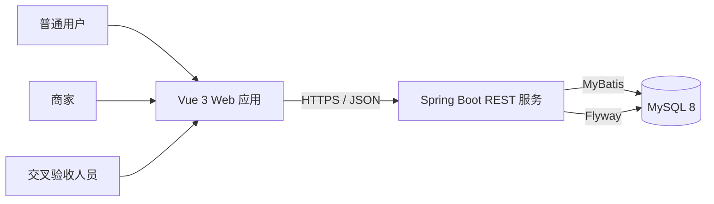
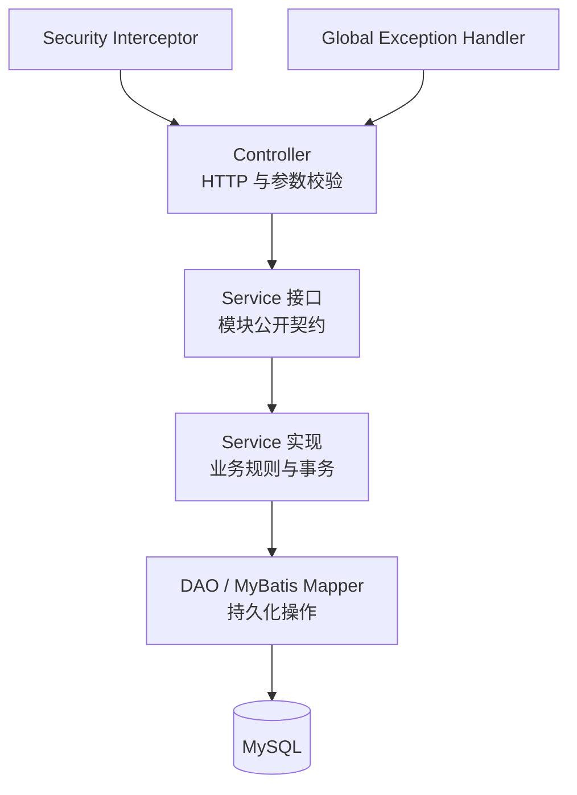
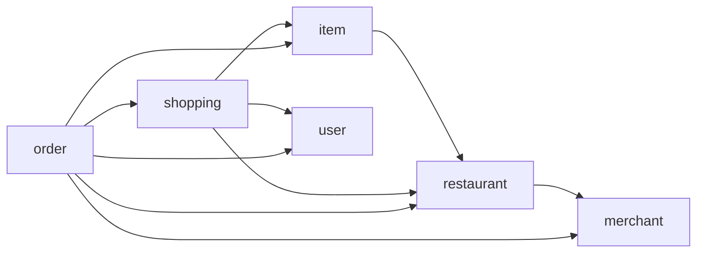
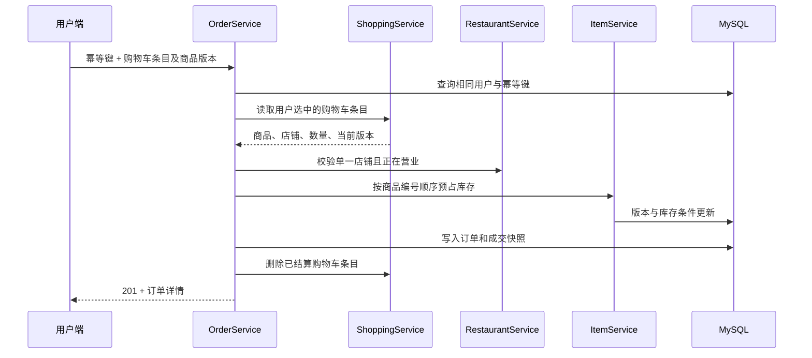

# 轻量级外卖服务平台系统架构设计

## 1. 设计目标

系统采用前后端分离和按业务领域组织的单体架构。在三周实践周期内，架构首先保证边界清楚、行为可测试、数据一致，并为第二阶段的业务规则变化保留扩展位置。系统不拆分微服务，不引入与项目规模不相称的中间件。

架构设计遵循以下原则：

1. 浏览器端只负责页面状态、交互和接口适配，业务判断以服务端结果为准。
2. 控制器处理 HTTP、参数校验和响应，服务层实现业务规则，DAO 只负责持久化。
3. 业务模块不能调用其他模块的 DAO，只能依赖对方公开的 Service 接口和数据对象。
4. 所有失败由统一异常机制转换为稳定的 HTTP 状态和业务错误码。
5. 涉及多次写操作的流程使用事务，库存竞争使用数据库条件更新和版本校验。

## 2. 系统上下文



普通用户和商家使用同一个前端应用，通过不同路由和布局进入消费端或商家端。前端统一以 `/api/v1` 为接口前缀，通过 Axios 发送 JSON 请求。后端完成身份识别、资源归属校验、业务计算和数据库访问。

## 3. 前端架构

前端使用 Vue 3、Vue Router、Element Plus、Axios 和 Vite，按职责分为五层：

| 层次 | 职责 | 主要内容 |
| --- | --- | --- |
| 应用入口 | 初始化应用和加载根路由 | `main.js`、`App.vue` |
| 路由层 | 划分登录注册、用户端、商家端和验收页面，执行角色守卫 | router 及 guards |
| 布局层 | 提供用户端、商家端统一页头、侧栏和内容区域 | CustomerLayout、MerchantLayout |
| 页面与组件层 | 展示店铺、商品、购物车、订单和资料，封装复用交互 | views、components |
| API 适配层 | 设置 `/api/v1` 基址、附加令牌、解包统一响应和处理错误 | api 模块 |

用户端路由包括店铺列表、店铺详情、商品详情、购物车、订单列表、订单详情和个人资料。商家端路由包括店铺管理、商品管理和商家资料。路由守卫根据本地保存的访问令牌和角色阻止未登录访问及跨角色访问；服务端仍会对每次受保护请求重新校验身份和权限。

API 适配层以本设计的后端接口为唯一契约。页面不直接拼装基础地址或解释业务错误结构，以便接口版本或统一处理方式变化时集中修改。

## 4. 后端总体结构

后端基于 Java 17、Spring Boot、Spring MVC 和 MyBatis。系统是一个可独立部署的应用，内部按照业务模块和通用基础能力组织。



### 4.1 分层职责

- **Controller**：声明路径和 HTTP 方法，接收 Path、Query、Header、Body 参数，执行 Bean Validation，并从请求中取得当前身份。
- **Service 接口**：定义模块可对外使用的业务行为及 DTO，是模块之间协作的边界。
- **Service 实现**：校验业务状态和资源归属，编排跨模块调用，声明事务并将 Entity 转换为返回 DTO。
- **DAO**：封装 SQL 查询与写入，不处理 HTTP，不决定跨领域业务规则。
- **Entity**：对应数据库持久化字段，也可承载查询联表得到的只读字段。

### 4.2 通用能力

`common` 提供统一响应、分页、删除结果、字段校验详情、业务异常和全局异常处理。`security` 提供当前身份、角色、公开接口标记、角色要求、令牌签发解析和 MVC 拦截器。这两部分可以被所有业务模块使用，但不依赖具体业务模块。

## 5. 业务模块与依赖

| 模块 | 负责内容 | 允许依赖的业务服务 |
| --- | --- | --- |
| user | 普通用户注册、登录、资料和状态 | 无 |
| merchant | 商家注册、登录、资料和状态 | 无 |
| restaurant | 店铺创建、查询、维护、归属和营业校验 | merchant |
| item | 分类、商品、版本控制、库存预占与恢复 | restaurant |
| shopping | 购物车所有权、数量、当前价格和结算条目 | user、item、restaurant |
| order | 下单、幂等、订单查询、取消和商家查询 | user、merchant、restaurant、shopping、item |



依赖只沿箭头方向发生。例如，订单模块通过购物车服务读取待结算条目，通过商品服务扣减或恢复库存，而不直接访问购物车或商品 DAO。

## 6. 接口与响应架构

所有业务接口位于 `/api/v1`。成功和失败均使用统一 JSON 外壳：

```json
{
  "code": 0,
  "msg": "操作成功",
  "data": {}
}
```

HTTP 状态表达协议层结果，`code` 表达稳定的业务结果。创建资源使用 `201 Created`，普通查询和修改使用 `200 OK`。参数错误、未登录、无权限、资源不存在和状态冲突分别使用 `400`、`401`、`403`、`404` 和 `409`。未预期异常统一返回 `500`，且不泄露内部堆栈。

分页结果统一包含 `items`、`page`、`pageSize`、`total`、`totalPages`。页码从 1 开始，默认页大小为 10，最大页大小为 100。

## 7. 身份与授权

普通用户和商家分别登录，认证成功后获得 Bearer 访问令牌。客户端后续请求使用以下请求头：

```http
Authorization: Bearer <access-token>
```

安全拦截器覆盖 `/api/v1/**`，根据接口标记决定公开访问、可选身份或强制角色。解析成功后，将包含主体编号和 `USER` 或 `MERCHANT` 角色的当前身份交给控制器。角色校验通过后，服务层继续校验账号状态和资源归属：商家只能维护自己名下的店铺、分类和商品，用户只能操作自己的购物车与订单。

账号密码使用 BCrypt 哈希保存。令牌签名密钥与有效期通过运行环境配置，默认有效期为 7200 秒；生产环境不得使用本地开发密钥。

## 8. 数据与事务设计

MySQL 是系统的唯一持久化数据源，Flyway 按版本执行结构迁移。MyBatis XML 保存显式 SQL，字段下划线命名自动映射为 Java 驼峰属性。

事务边界位于服务实现：

- 注册、资料修改、店铺与商品维护等单一业务写操作使用事务。
- 创建订单将校验购物车、校验商品版本、原子扣减库存、写订单及明细、删除已结算购物车条目放在同一事务中。
- 取消订单将订单状态变更和库存恢复放在同一事务中。
- 商品更新携带版本号，更新条件同时匹配商品编号和旧版本；成功后版本加一。
- 库存扣减使用“库存不少于购买量”的条件更新，避免并发下出现负库存。

## 9. 关键流程

### 9.1 登录流程

1. 客户端向用户或商家登录接口提交账号和密码。
2. 对应服务按规范化账号查询记录并验证 BCrypt 密码。
3. 服务检查账号为可用状态，签发包含主体编号和角色的访问令牌。
4. 前端保存令牌和角色，用于请求头和路由导航。

### 9.2 加入购物车

1. 用户提交商品编号和正整数数量。
2. 购物车服务确认用户可用，商品在售且店铺营业。
3. 若相同商品已在购物车中，则在库存范围内合并数量；否则新建条目。
4. 返回条目、商品当前信息、小计和可用状态。

### 9.3 创建订单



相同幂等键与相同请求内容返回已有订单；相同幂等键对应不同内容时返回冲突。结算前后若商品版本变化，系统返回价格变化错误，要求客户端刷新购物车后重新确认。

### 9.4 取消订单

用户只能取消自己的待支付订单。服务使用带状态条件的更新将订单改为 `CANCELLED` 并记录取消时间，再根据订单明细恢复库存。状态已经变化时返回订单状态冲突，不重复恢复库存。

## 10. 可变需求的扩展方式

- 新的业务领域建立独立模块，通过 Service 接口接入现有流程。
- 新字段先修改需求与数据库设计，再增加 Flyway 迁移、DTO、服务规则和测试，不改写已执行迁移。
- 新订单动作优先以 `/orders/{orderId}/动作` 表达，并在服务层集中维护状态迁移规则。
- 新筛选条件通过 Query 参数增加，保持已有参数默认行为不变。
- 破坏兼容性的接口变化使用新版本路径，`/api/v1` 在兼容期内保留。
- 重构只改变内部结构时保持公开 Service 契约和 HTTP 行为不变，并以回归测试证明兼容性。

## 11. 运行与部署边界

开发环境由 Vite 提供前端服务，Spring Boot 提供后端服务，MySQL 保存数据。后端数据库账号、密码和 JWT 密钥通过环境变量注入。部署前必须执行数据库迁移和完整测试；前端构建产物与后端服务可以由同一反向代理对外提供，但两者保持独立构建。
