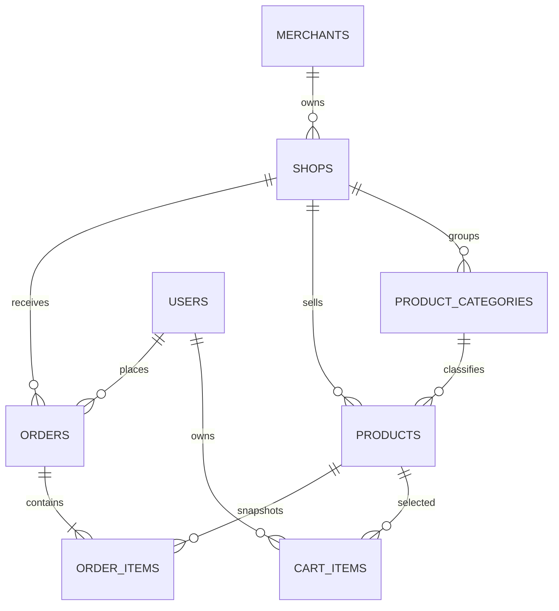

# 轻量级外卖服务平台数据库设计

## 1. 设计范围与原则

数据库使用 MySQL 8，所有结构变化通过 Flyway 版本迁移执行。当前有效结构由初始核心表和后续对齐迁移共同组成；实际建库后以迁移执行结果为准。

设计遵循以下原则：

- 业务主键统一使用 `BIGINT UNSIGNED AUTO_INCREMENT`。
- 金额使用 `DECIMAL(10,2)`，不使用浮点数。
- 状态使用受检查约束保护的字符串，状态变化由服务层控制。
- 订单保存商品和店铺快照，保证历史数据不随当前资料变化。
- 店铺和分类使用逻辑删除，避免破坏历史关系。
- 外键默认限制删除，业务上优先修改状态或逻辑删除。
- 创建和更新时间由数据库默认值维护；更新字段使用 `ON UPDATE CURRENT_TIMESTAMP(3)`。
- 所有表和字段使用 `utf8mb4` 字符集，排序规则使用大小写不敏感的通用配置。

## 2. 实体关系

商家与普通用户没有外键关系，两个账号体系独立。一个商家可以拥有多个店铺；一个店铺可以有多个分类和商品。购物车条目属于一个用户和一个商品，订单属于一个用户和一个店铺，订单明细保存下单时的商品信息快照。

## 3. 表结构

### 3.1 `users` 普通用户

| 字段 | 类型 | 空 | 默认值 | 说明 |
| --- | --- | --- | --- | --- |
| `id` | BIGINT UNSIGNED | 否 | 自增 | 主键 |
| `account` | VARCHAR(50) | 否 | — | 登录账号，唯一 |
| `password_hash` | VARCHAR(100) | 否 | — | BCrypt 哈希，不保存明文 |
| `nickname` | VARCHAR(50) | 否 | — | 昵称 |
| `phone` | VARCHAR(20) | 是 | NULL | 电话 |
| `status` | VARCHAR(20) | 否 | `ACTIVE` | `ACTIVE` 或 `DISABLED` |
| `created_at` | DATETIME(3) | 否 | 当前时间 | 创建时间 |
| `updated_at` | DATETIME(3) | 否 | 当前时间 | 最后更新时间 |

约束：`uk_users_account(account)`；`status` 只能为 `ACTIVE` 或 `DISABLED`。禁用用户记录保留，服务层禁止其登录和业务操作。

### 3.2 `merchants` 商家

| 字段 | 类型 | 空 | 默认值 | 说明 |
| --- | --- | --- | --- | --- |
| `id` | BIGINT UNSIGNED | 否 | 自增 | 主键 |
| `account` | VARCHAR(50) | 否 | — | 商家登录账号，唯一 |
| `password_hash` | VARCHAR(100) | 否 | — | BCrypt 哈希 |
| `name` | VARCHAR(100) | 否 | — | 商家名称 |
| `phone` | VARCHAR(20) | 否 | — | 联系电话 |
| `status` | VARCHAR(20) | 否 | `ACTIVE` | `ACTIVE` 或 `SUSPENDED` |
| `created_at` | DATETIME(3) | 否 | 当前时间 | 创建时间 |
| `updated_at` | DATETIME(3) | 否 | 当前时间 | 最后更新时间 |

约束：`uk_merchants_account(account)`；`status` 只能为 `ACTIVE` 或 `SUSPENDED`。商家不通过 `user_id` 关联普通用户。

### 3.3 `shops` 店铺

| 字段 | 类型 | 空 | 默认值 | 说明 |
| --- | --- | --- | --- | --- |
| `id` | BIGINT UNSIGNED | 否 | 自增 | 主键 |
| `merchant_id` | BIGINT UNSIGNED | 否 | — | 所属商家 |
| `name` | VARCHAR(100) | 否 | — | 店铺名称 |
| `description` | VARCHAR(500) | 是 | NULL | 店铺说明 |
| `status` | VARCHAR(30) | 否 | `CLOSED` | `OPEN`、`CLOSED`、`TEMPORARILY_CLOSED` |
| `created_at` | DATETIME(3) | 否 | 当前时间 | 创建时间 |
| `updated_at` | DATETIME(3) | 否 | 当前时间 | 最后更新时间 |
| `deleted_at` | DATETIME(3) | 是 | NULL | 逻辑删除时间 |

约束：外键 `merchant_id -> merchants.id`；`uk_shops_merchant_name(merchant_id,name)`；`status` 受检查约束保护。公开查询只读取 `deleted_at IS NULL` 的营业店铺；商家自己的查询可以看到未删除的其他状态。

索引：`idx_shops_public_list(deleted_at,status,created_at)` 支持公开列表筛选和排序。

### 3.4 `product_categories` 商品分类

| 字段 | 类型 | 空 | 默认值 | 说明 |
| --- | --- | --- | --- | --- |
| `id` | BIGINT UNSIGNED | 否 | 自增 | 主键 |
| `shop_id` | BIGINT UNSIGNED | 否 | — | 所属店铺 |
| `name` | VARCHAR(100) | 否 | — | 分类名称 |
| `sort_order` | INT UNSIGNED | 否 | 0 | 店内排序值 |
| `created_at` | DATETIME(3) | 否 | 当前时间 | 创建时间 |
| `updated_at` | DATETIME(3) | 否 | 当前时间 | 最后更新时间 |
| `deleted_at` | DATETIME(3) | 是 | NULL | 逻辑删除时间 |

约束：外键 `shop_id -> shops.id`；`uk_categories_shop_name(shop_id,name)`；删除前必须确认没有商品引用。列表按 `sort_order ASC, id ASC` 返回。

索引：`idx_categories_shop_order(shop_id,deleted_at,sort_order,id)`。

### 3.5 `products` 商品

| 字段 | 类型 | 空 | 默认值 | 说明 |
| --- | --- | --- | --- | --- |
| `id` | BIGINT UNSIGNED | 否 | 自增 | 主键 |
| `shop_id` | BIGINT UNSIGNED | 否 | — | 所属店铺 |
| `category_id` | BIGINT UNSIGNED | 否 | — | 所属分类 |
| `name` | VARCHAR(100) | 否 | — | 商品名称 |
| `description` | VARCHAR(1000) | 是 | NULL | 商品说明 |
| `price` | DECIMAL(10,2) | 否 | — | 当前单价，必须大于 0 |
| `stock` | INT UNSIGNED | 否 | 0 | 当前库存 |
| `status` | VARCHAR(20) | 否 | `OFF_SALE` | `ON_SALE` 或 `OFF_SALE` |
| `version` | BIGINT UNSIGNED | 否 | 1 | 乐观锁版本 |
| `created_at` | DATETIME(3) | 否 | 当前时间 | 创建时间 |
| `updated_at` | DATETIME(3) | 否 | 当前时间 | 最后更新时间 |

约束：外键 `shop_id -> shops.id`、`category_id -> product_categories.id`；`price > 0`、`stock >= 0`；`status` 只能为 `ON_SALE` 或 `OFF_SALE`。应用层另行确认分类与商品属于同一店铺。

索引：`idx_products_shop_status(shop_id,status)`、`idx_products_category(category_id)`。

版本规则：每次成功修改商品时 `version = version + 1`；更新 SQL 必须同时匹配 `id` 和旧版本。库存预占按 `id`、版本、在售状态和充足库存做条件更新，成功行数必须为 1。

### 3.6 `cart_items` 购物车条目

| 字段 | 类型 | 空 | 默认值 | 说明 |
| --- | --- | --- | --- | --- |
| `id` | BIGINT UNSIGNED | 否 | 自增 | 主键 |
| `user_id` | BIGINT UNSIGNED | 否 | — | 所属用户 |
| `product_id` | BIGINT UNSIGNED | 否 | — | 商品 |
| `quantity` | INT UNSIGNED | 否 | — | 数量，必须大于 0 |
| `created_at` | DATETIME(3) | 否 | 当前时间 | 创建时间 |
| `updated_at` | DATETIME(3) | 否 | 当前时间 | 最后更新时间 |

约束：`uk_cart_items_user_product(user_id,product_id)` 确保同一用户同一商品只有一条记录；外键分别指向 `users` 和 `products`；`quantity > 0`。删除购物车条目使用物理删除，订单明细承担历史快照职责。

索引：`idx_cart_items_user(user_id)`。

购物车查询通过商品和店铺联表取得当前名称、价格、库存、商品版本、商品状态和店铺状态，这些字段不是购物车表中重复保存的业务事实。

### 3.7 `orders` 订单

| 字段 | 类型 | 空 | 默认值 | 说明 |
| --- | --- | --- | --- | --- |
| `id` | BIGINT UNSIGNED | 否 | 自增 | 主键 |
| `order_no` | VARCHAR(40) | 否 | — | 对外订单号，唯一 |
| `user_id` | BIGINT UNSIGNED | 否 | — | 下单用户 |
| `idempotency_key` | VARCHAR(100) | 否 | — | 用户维度幂等键 |
| `request_fingerprint` | CHAR(64) | 否 | — | 条目与版本请求的 SHA-256 摘要 |
| `shop_id` | BIGINT UNSIGNED | 否 | — | 下单店铺 |
| `shop_name` | VARCHAR(100) | 否 | — | 店铺名称快照 |
| `total_amount` | DECIMAL(10,2) | 否 | — | 订单总额，必须大于 0 |
| `status` | VARCHAR(30) | 否 | `PENDING_PAYMENT` | 订单状态 |
| `created_at` | DATETIME(3) | 否 | 当前时间 | 创建时间 |
| `updated_at` | DATETIME(3) | 否 | 当前时间 | 最后更新时间 |
| `cancelled_at` | DATETIME(3) | 是 | NULL | 取消时间 |

约束：`uk_orders_order_no(order_no)`；`uk_orders_user_idempotency(user_id,idempotency_key)`；外键指向 `users` 和 `shops`；`total_amount > 0`；状态只能为 `PENDING_PAYMENT`、`PAID`、`PREPARING`、`DELIVERING`、`COMPLETED` 或 `CANCELLED`。

索引：`idx_orders_user_created(user_id,created_at)` 支持用户订单列表；`idx_orders_shop_status_created(shop_id,status,created_at)` 支持商家按店铺和状态查询。

幂等规则：同一用户和幂等键只对应一条订单。应用层先比较请求摘要；摘要相同返回旧订单，摘要不同返回幂等冲突。数据库唯一约束负责处理并发竞争。

### 3.8 `order_items` 订单明细

| 字段 | 类型 | 空 | 默认值 | 说明 |
| --- | --- | --- | --- | --- |
| `id` | BIGINT UNSIGNED | 否 | 自增 | 主键 |
| `order_id` | BIGINT UNSIGNED | 否 | — | 所属订单 |
| `product_id` | BIGINT UNSIGNED | 否 | — | 商品标识 |
| `product_name` | VARCHAR(100) | 否 | — | 商品名称快照 |
| `unit_price` | DECIMAL(10,2) | 否 | — | 成交单价快照 |
| `quantity` | INT UNSIGNED | 否 | — | 成交数量，必须大于 0 |

约束：外键 `order_id -> orders.id`、`product_id -> products.id`；`unit_price > 0`、`quantity > 0`。订单明细不保存商品版本，因为版本用于结算前校验，名称和单价快照用于历史展示。

索引：`idx_order_items_order(order_id)`。

## 4. 一致性与并发

### 4.1 下单事务

订单服务在一个事务内完成：校验用户和幂等键、读取购物车、确认单一店铺、确认店铺营业、按商品编号排序预占库存、写入订单、写入明细、删除购物车条目。任一步骤失败，整个事务回滚，库存和购物车保持原状。

### 4.2 库存预占与恢复

预占库存的 SQL 同时检查商品版本、在售状态和库存数量，并通过受影响行数判断成功。多个商品按 `product_id` 升序处理，减少并发下的锁顺序差异。取消待支付订单时，根据明细逐项恢复库存；状态条件更新失败时不重复恢复。

### 4.3 软删除与历史数据

店铺和分类只设置 `deleted_at`，所有正常查询都过滤逻辑删除记录。商品不做逻辑删除，使用 `OFF_SALE` 表示不再公开销售。订单保留店铺、商品名称和价格快照，即使后续资料被修改，历史订单仍可正确展示。

## 5. 迁移与发布顺序

1. 初始化迁移创建核心表、外键、唯一约束、检查约束和基础索引。
2. 对齐迁移将商家改为独立账号，允许商家拥有多个店铺，为店铺和分类增加逻辑删除，为商品增加版本，为订单增加幂等和快照字段，并扩展订单状态。
3. 后续变更只能新增迁移文件，不能修改已在共享环境执行的迁移。
4. 每次迁移提交前在干净数据库执行一次，在已有数据库执行一次，并运行 DAO 集成测试。
5. 发布顺序为：备份数据库 → 执行 Flyway 校验和迁移 → 启动后端 → 执行健康检查与核心接口测试。

## 6. 数据访问约定

DAO 只负责参数化 SQL、结果映射和受影响行数返回。服务层负责：

- 检查主体状态、资源所有权和跨表业务关系；
- 将数据库空结果转换为资源不存在或业务冲突；
- 校验分页、排序、状态和值域；
- 在事务边界内编排多个 DAO 和跨模块 Service 调用。

不在数据库触发器中隐藏订单状态、库存或权限规则，确保规则可由服务测试直接验证。

## 7. 备份与敏感数据

生产连接信息、数据库密码和令牌密钥只从运行环境注入，不写入文档示例或版本库。备份应包含结构和业务数据并定期验证恢复；密码哈希可以备份，但原始密码永不落库。
