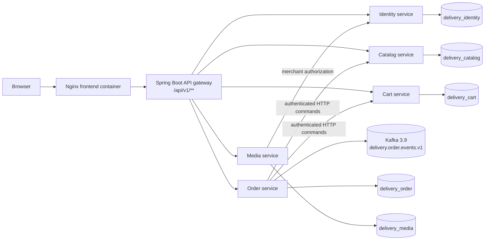

# Backend migration to a Kafka-based microservices architecture

## 1. Purpose and scope

This report describes the implemented migration from the original Spring Boot backend to independently deployable domain services. The migration keeps the existing Vue client contract (`/api/v1/**`) while moving ownership of data and writes into five services. Kafka is the only asynchronous transport in the runtime design; RabbitMQ is not used.

The report is aligned with the project handout's functional modules—users, merchants, shops, products, cart, orders, payments, refunds, and images—and records the implementation and acceptance evidence. The authoritative handout remains unchanged.

The migration has four goals:

1. Split the platform along business ownership boundaries.
2. Prevent one service from writing another service's tables.
3. Make checkout safe across service and broker failures.
4. Preserve the frontend's existing API and browser behavior during the transition.

## 2. Architecture after migration

The request path is:



The frontend serves the compiled Vue application and proxies `/api/` to the gateway. The gateway forwards the original path, query string, selected headers, request body, response status, and response content type. It also adds an `X-Correlation-Id` when the caller did not provide one. The browser therefore continues to use the same versioned API origin and does not need to know service hostnames.

The gateway selects a target by the first resource segment:

| Public resource prefix | Owning service |
| --- | --- |
| `users`, `merchants`, `user-addresses` | Identity |
| `shops`, `products`, `skus`, `categories` | Catalog |
| `cart-items` | Cart |
| `orders`, `merchant/orders` | Order |
| `files`, `uploads` | Media |

Unknown routes return a gateway error. Compose and Kubernetes deployments route public resources only to the extracted services.

## 3. Service boundaries and ownership

Each service is a Spring Boot application with its own source tree, Flyway migrations, HTTP controllers, authentication interceptor, validation, exception handling, datasource, and database credential. The boundaries are designed so each service can be placed on a physically separate database without changing ownership or write paths. The current deployment places the separate schemas on one MySQL instance to reduce CPU, memory, and operational overhead. The boundaries are:

| Service | Responsibilities | Owned tables | Important APIs |
| --- | --- | --- | --- |
| Identity | User and merchant registration/login, profiles, addresses, JWT principals | `users`, `merchants`, `user_addresses` | `/api/v1/users`, `/api/v1/merchants`, `/api/v1/user-addresses` |
| Catalog | Shops, categories, products, SKUs, stock and stock leases | `shops`, `product_categories`, `products`, `product_skus`, `stock_reservations` | `/api/v1/shops`, `/api/v1/products`, `/api/v1/skus`, `/api/v1/categories` |
| Cart | Customer cart items and checkout claims | `cart_items` | `/api/v1/cart-items` |
| Order | Order snapshots, payment/refund state, customer and merchant order actions, checkout coordination | `orders`, `order_items`, `payments`, `refunds`, `checkout_decisions`, `order_event_outbox`, `order_stock_release_outbox` | `/api/v1/orders`, `/api/v1/merchant/orders` |
| Media | Image metadata, content storage, upload validation, image reads | `images` | `/api/v1/files/images`, `/uploads/products/{id}` |

The order service stores immutable product, shop, and address snapshots in an order. This means an order can still be displayed when a catalog name or address later changes. The catalog, cart, and order schemas contain local read-model tables for data needed by existing mappers. These projections are refreshed from owning-service APIs or events and do not transfer ownership: authoritative writes go through the owning service command.

## 4. Database isolation

The MySQL instance contains separate schemas:

```text
delivery_identity   identity_app
delivery_catalog    catalog_app
delivery_cart       cart_app
delivery_order      order_app
delivery_media      media_app
```

`deploy/mysql/01-create-service-databases.sh` creates the schemas and users. Each service user has full privileges only on its owned schema; there are no cross-schema grants. Read models are refreshed through authenticated service APIs or event streams, so no service needs SQL access to another domain.

Flyway creates owned tables and local read-model tables in each service schema. The read models allow existing mappers to resolve data without cross-schema SQL access; they are not authoritative. Legacy data must be imported through an owner-service API or a separately managed export/import job; the removed monolith backfill script is not part of new deployments. Subsequent deployments must refresh projections through an owner-service API or event stream. The migration does not use cross-schema views, write triggers, or shared write repositories.

## 5. API and security behavior

The public contract remains versioned under `/api/v1`. Existing resource-oriented routes and action routes such as payment, cancellation, preparation, delivery, and receipt confirmation remain available. The gateway forwards `Authorization`, content negotiation, idempotency headers, and `If-Match`; it does not expose internal service endpoints.

Services independently verify the same signed JWT (`sub`, role, issue time, and expiry). Role checks are enforced at controllers. Service-to-service commands use `X-Service-Token` and are registered under `/internal/v1/**`; the internal interceptor rejects requests without the configured token. Examples include:

- order → catalog: reserve, confirm, or restore stock;
- order → cart: claim or release selected cart rows;
- media → identity: verify the merchant allowed to upload an image;
- cart/catalog → order: query the durable checkout decision during recovery.

The internal token is separate from a customer's JWT. Service URLs, JWT settings, database credentials, and the token are injected through Compose or Kubernetes configuration rather than committed application constants.

## 6. Checkout and event reliability

Checkout spans order, catalog, and cart data, so it is implemented as a durable decision workflow rather than as an unbounded chain of best-effort calls.

### 6.1 Normal checkout

1. The customer submits `POST /api/v1/orders` with `X-Idempotency-Key`.
2. The order service hashes the request and creates or reuses a `checkout_decisions` row in state `OPEN`. A different payload with the same user/key is rejected.
3. The order service asks cart to claim the selected rows using the decision ID.
4. It asks catalog to reserve each SKU/product quantity using the same decision ID. Reservation inserts are idempotent.
5. The order transaction stores order and item snapshots, marks the decision `COMMITTED`, and writes an `OrderCreated` payload to `order_event_outbox`.
6. A scheduled publisher retries unsent outbox rows to Kafka topic `delivery.order.events.v1` using an idempotent producer.
7. Once the order is committed, the publisher confirms the catalog reservation. Cart and catalog reapers query the order decision and clean up only abandoned `OPEN` or `ABORTED` work.

The decision ID is the correlation key across all three services. Repeating the same request returns the existing result; it cannot create a second order or double-reserve stock.

### 6.2 Failure and compensation

If a reservation or cart claim fails, the decision becomes `ABORTED`; already completed steps are compensated. If cancellation releases stock, `order_stock_release_outbox` records the release command and retries it until catalog acknowledges it. The catalog reservation ledger makes release idempotent, so a retry cannot restore stock twice.

If Kafka is down after the database commit, the order remains visible and the outbox row remains unpublished. The stock lease is confirmed independently of Kafka, so broker downtime does not make a committed order expire. When Kafka returns, the publisher drains the outbox. This is the intended at-least-once delivery model; consumers must deduplicate by event ID.

## 7. Frontend involvement

The frontend is part of the compatibility boundary, not a second backend implementation. Its Axios wrapper continues to call relative `/api/v1` URLs, and Nginx sends those requests to the gateway. No service-specific base URLs or credentials are embedded in Vue code.

The existing pages exercise the migrated routes for:

- customer and merchant registration/login;
- shop and product browsing;
- cart updates;
- image upload and image retrieval;
- customer checkout, payment, cancellation, and receipt confirmation;
- merchant order preparation and delivery.

This arrangement permits services to be deployed or scaled independently while the browser sees one origin and one stable API contract. A future `/api/v2` can be introduced for breaking changes while `/api/v1` remains routed through the gateway.

## 8. Deployment topology

### Compose

`docker-compose.yml` starts MySQL, Kafka 3.9, the five services, the gateway, and the frontend. Service health and startup dependencies are declared for the database and gateway. Kafka runs in single-node KRaft mode for local acceptance, with topic auto-creation enabled for development. The frontend is exposed on port 5173 and the gateway on port 8081 by default.

The Compose stack is suitable for migration acceptance and local development. It uses a named MySQL volume; acceptance runs should use a disposable Compose project and volume so a failed experiment cannot alter a developer database.

### Kubernetes

`deploy/k8s/` provides a `delivery` namespace, Kafka, domain-service deployments, gateway deployment/service, and an ingress for `/api/v1`. The gateway has two replicas and readiness/liveness probes. Domain services are addressed by Kubernetes service names. Database credentials, JWT secrets, and internal tokens are deployment configuration and should be supplied as Kubernetes Secrets in a production cluster.

## 9. Data migration and rollback

The migration is designed as a staged cutover:

1. Provision fresh service schemas and wait for Flyway migrations.
2. Freeze legacy writes.
3. Import any retained legacy data through owner-service APIs or a separately managed export/import job.
4. Compare row counts and representative IDs in the source export and service schemas.
5. Route reads and writes through the gateway to the extracted services.
6. Monitor service health, outbox lag, reservation cleanup, and API error rates.

The backfill script is retained as a one-time migration aid for environments that still contain legacy data. New deployments provision service schemas directly. Rollback uses database snapshots and service-level recovery; there is no legacy application target.

## 10. Acceptance strategy

Existing backend tests, frontend unit tests, and existing end-to-end tests were treated as regression hints rather than migration evidence. The integration checks were derived independently from the handout, public controllers, database migrations, gateway contract, and observable user workflows. Checks run against disposable infrastructure wherever possible.

### Structural and isolation checks

`e2e/integration/test_schema_ownership.py` starts a fresh MySQL container, applies the checked-in migrations, verifies that each domain has its physical tables, and verifies that cross-domain objects are views rather than duplicate base tables. It also reads representative catalog and cart data through order projections.

`e2e/integration/test_database_privileges.py` runs the same initializer with separate credentials and attempts both permitted writes and forbidden cross-schema reads/writes. This verifies isolation from outside the application code.

`e2e/integration/test_media_isolation.py` launches identity and media independently and checks merchant authorization, upload validation, image readback, and media schema isolation.

### Black-box frontend and workflow checks

`e2e/integration/test_frontend_gateway_workflow.py` uses the browser-facing API origin through Nginx and verifies the gateway route map and core customer/merchant workflow. `test_frontend_browser.py` starts a clean Chrome process, loads the compiled Vue bundle, and performs an API request from the page origin. These tests do not import frontend components or rely on existing frontend unit-test coverage.

`e2e/integration/test_checkout_lifecycle.py` independently performs payment, merchant preparation, delivery, receipt confirmation, cancellation, and stock restoration. It checks externally observable state transitions and compensation behavior.

`e2e/integration/test_kafka_outage.py` stops Kafka in an explicitly named disposable Compose project after an order commits, verifies the outbox row remains unpublished, restarts Kafka, and verifies that the row is eventually published.

The consolidated commands are:

```bash
./scripts/run-microservices-tests.sh

DELIVERY_BASE_URL=http://localhost:5173/api/v1 \
  ./scripts/run-microservices-acceptance.sh
```

The implementation checkpoint passed schema ownership, database privilege, media isolation, gateway workflow, Chrome browser smoke, order lifecycle/compensation, Kafka outage recovery, Maven builds for all six Java applications, gateway tests, and Compose configuration validation. These results establish migration behavior; they do not claim that the untrusted legacy suites are complete.

## 11. Operational risks and next hardening step

The current design keeps a small number of local read models so the existing mapper and API behavior can be migrated without a simultaneous frontend rewrite. They preserve ownership because service users cannot write another domain's schema. Moving MySQL schemas to separate servers therefore changes datasource and deployment configuration rather than domain ownership; projection refreshes continue through service APIs or event streams. Other production follow-ups are multi-broker Kafka replication, external secret management, metrics for outbox age and checkout decisions, distributed tracing using `X-Correlation-Id`, and a rehearsed snapshot/restore rollback procedure.

## 12. Implementation references

- Gateway routing: `gateway/src/main/java/com/delivery/gateway/ApiGatewayController.java`
- Service schemas: `services/*-service/src/main/resources/db/migration/`
- Checkout coordination: `services/order-service/src/main/java/com/delivery/order/checkout/`
- Kafka publisher and outboxes: `services/order-service/src/main/java/com/delivery/order/events/OrderEventPublisher.java`
- Database users and grants: `deploy/mysql/01-create-service-databases.sh`
- Local topology: `docker-compose.yml`
- Kubernetes topology: `deploy/k8s/domain-services.yaml`, `deploy/k8s/services.yaml`, `deploy/k8s/kafka.yaml`
- Legacy data import: owner-service APIs or a separately managed export/import job
- Independent acceptance checks: `e2e/integration/`
